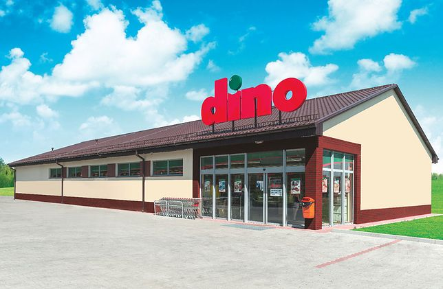
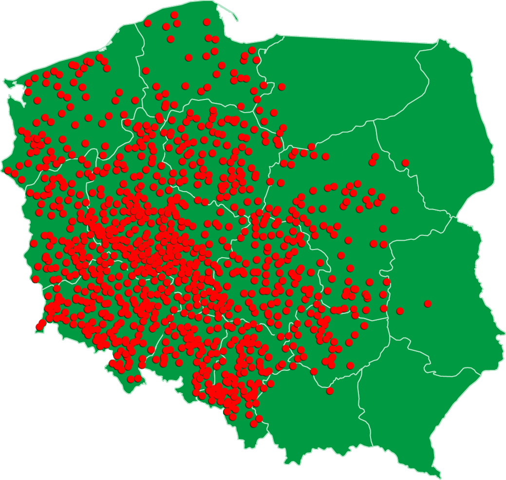
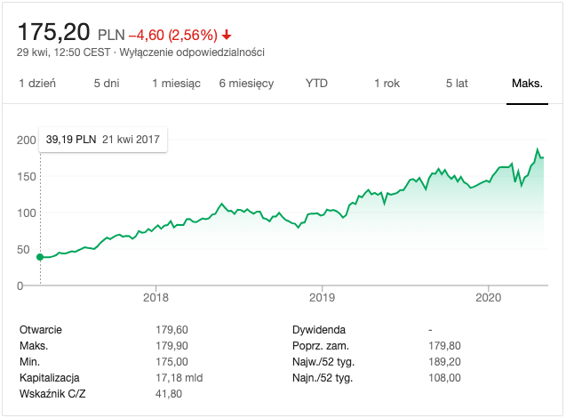

```{r include = FALSE}
library('tidyverse')
library('readxl')
library('knitr')
library('kableExtra')
library('formattable')
```

---

<section style="float: left;">

<H1>Analiza RPP spóki Dino</h1>    

425998    

28/04/2020    


</section>

## Agenda

- Historia rozwoju
- Akcjonariat
- Model biznesowy
- Notowania na giełdzie
- Analiza pionowa i pozioma
- Analiza wskaźnikowa

<div class="notes">

Dzień dobry
Tematem prezentacji będzie analiza rachunku przepływów pieniężnych spółki dino. 

prezentację rozpoczniemy od przedstawienia historii rozwoju spółki i jej akcjonariat.
następnie omówimy model biznesowy spółki i notowania na giełdzie. A na koniec 
przeprowadzimy analizę pionową, poziomą i wskaźnikową.

</div>

## Dino Polska S.A.


     
&nbsp;

- Polska sieć handlu spożywczego
- Lokalizacja na obszarach małych i średnich miejscowości
- W latach 2010-2019 wzrost liczby sklepów o 1117 obiektów


<div class="notes">

Spółka Dino to Polska sieć handlu spożywczego założona w 1999 (tysiąc dziewięćset dziewięćdziesiątym dziewiątym) roku przez Tomasza Biernackiego. 
Jest to wiodący gracz w rosnącym segmencie średniej wielkości supermarketów w Polsce, 
zlokalizowanych głównie w mniejszych miejscowościach, małych i średnich
miastach oraz na peryferiach dużych miast.
W latach 2010-2019 (dwa tysiące dziesięć dwa tysiące dziewiętnaście) liczba sklepów wzrosła ze 111 (stu jedenastu) na koniec 2010 (dwa tysiące dziesiątego roku) do 1218 (tysiąca dwustu osiemnastu) na koniec 2019 (dwa tysiące dziewiętnastego) roku.

</div>

## Historia rozwoju

<div class="fragment">
- **Faza 1**
  - 1999 : Pierwsze sklep pod marką dino
  - 2002 : Pierwsze centrum dystrybucyjne
  - 2003 : Dino zacieśnia relacje z zakadami mięsnymi Agro-Rydzyna
  - 2004-2009 : Rozwój wokół centrum dystrybucyjnego
  - 2010 : 100 Sklepów i okres dynamicznej ekspansji
</div>

&nbsp;
<div class="fragment">
- **Faza 2**
  - 2013 : 300 sklepów i drugie centrum Dystrybucyjne
  - 2014 - 2015 : 500 sklepów 
  - 2016 : 10,000 pracaowników i trzecie centrum Dystrybucyjne
  - 2017 : Debiut na GPW
  - 2018 : 202 otwarcia nowych marketów
  - 2019 : 243 nowe markety
</div>

<div class="notes">
można zauważić dwie głowny fazy rozwoju spólki.

w pierszej fazie doszło do powstania pierwszego centrum dystrybucyjnego, 
nawiązania współpracy z zakładami mięsnymi Agro-Rydzyna, i powstania 100 (stu) sklepów

W drugiej fazie, zaczynając od 2010 roku, doszło do nabycia 49% udziałów spółki Dino przez 
Enterprise Investors(fundusz typu private equity), co pozwoliłó na dynamiczny rozwój 
spółki w kolejnych latach.
W 2017 (dwa tysiścy siedemnastym roku) doszło do debiutu Dino Polska na giełdzie, 
i odsprzedania wszystkich udziałów przez Enterprise Investors. 

</div>

## Wzrost liczby sklepów

<section>
  
  
</section>


<div class="notes">

Sieć rozwija się dynamycznie na terenach południowo zachodniej Polski, 
i ma duzy potencjał na dalszy rozwój na wschodzie kraju.

</div>

## Akcjonariat


<div class="notes">
Ponad 50% udziałow należy do założyciela spółki, co ma wpływ na ład korporacyjny. Założyciel zasadniczo decyduje o wszystkich najważniejszych decyzjach, takich jak wzrost spółki, dywidendy do wypłaty, reinwestowanie, fuzje i przejęcia itp (i tym podobny).

Zanim prejdziemy do sprawozdania finansowego, spróbujmy zrozumieć podstawy działania biznesu supermarketów, 
które pomogą nam dowiedzieć się, jakie czynniki są istotne. 

</div>

## Model biznesowy

&nbsp;
&nbsp;
<div class="fragment">

<h4>Niektóry cechy:</h4>
    

1. Niska **marża** zysku netto (< 5%)
2. Wysoka **wielkość** sprzedaży
3. biznes kapitałochłonny

</div>


<div class="notes">
Należy zauważyć, że supermarket jest przedsiębiorstwem usługowym, 
który nie wytwarza fizycznie żadnego produktu w dosłownym znaczeniu tego słowa.
Jedynie nabywa istniejące produkty od
dostawców, przechowuje je w regionalnych magazynach, dystrybuuje do lokalnych
sklepów, a na koniec sprzedaje je klientom.

Jest kilka czynników wpływających na niską marże zysku netto (mniej niż 5%):
niska marża na produktach jest charakterystyczna dla branży supermarketów.
klienci oczekują niskich cen artykułów codziennego użytku, 
  które nie należą  do klasy produktów luksusowych.

wysoka **wielkoścć** sprzedaży kompensuje niską marżę zysku.

Typowy klient kupuje średio 10 produktów przy jednorazowej wizycie.

Kolejną cechą to biznes kapitałochłonny. W skład spólki 
wchodzi wiele nieruchomości w postaci budynków.


</div>

## Charakerystyka Dino

<h5>Szybko rozwijająca się firma (high growth company)</h5>

&nbsp;

1. Wyższe wydatki z działalności inwestycyjnej
2. Niska dywidenda 
3. Wisoki zwrot z kapitału własnego (ROE), zwrot z aktywów (ROA)
4. Jakie są opcje finansowania nowo powstających sklepów?
      1. Sprzedaż nowych akcji
      2. Zysk z działalności operacyjnej
      3. Emitowanie obligacji lub zaciąganie kredytu
  
<div class="notes">


Dino Polska to dynamicznie rozwijająca się firma, w związku z czym oczekujemy Wyższych 
wydatków z działalności inwestycyjnej, proporcjonalnych do liczby nowo otwieranych sklepów.
Jak również oczekujemy niskiej dywidendy.

Możemy równiez się spodziewać wysokiego zwrotu z kapitału własnego i aktywów, zakładając, że 
rozwój spółki będzie utrzymywać się na podobnym poziomie.

Można wziąć pod uwagę różne opcje finansowania nowo powstających sklepów.
Perwszą opcją jest sprzedaż nowych akcji na giełdie. Ale w przypadku Dino Polska jest mało prawdopodobne, 
ponieważ 51% akcji należy do założyciela. Jeśli zacząłby odsprzedawać akcje to straciłby decyjzyny głos 
w zarządzaniu spółką.
Drugą opcją może być zysk z działalności operacyjnej, jednak jest to methoda niewystarczająca dla tego
pozioma rozwoju jaki ma spółka Dino (otwieranych jest ponad 200 sklepów rocznie)
Trzecią opcją jest emitowanie obligacji lub zaciąganie kredytu, co jest najbardziej prawdopodobną opcą finansowania.

</div>

## Konkurencja
```{r echo = FALSE}
tribble(
  ~Sieć, ~`Liczba sklepów w Polsce`, ~Siedziba,
  "Biedronka", 3000, "Portugal",
  "Dino",1218, "Poland",
  "Lidl", 700, "Germany",
  "Stokrotka", 577, "Poland",
  "Netto", 368, "Denmark",
  "Polomarket", 280, "Poland",
  "Eurospar", 250, "Netherlands",
  "Intermarché", 230, "France",
  "Mila",187, "Poland",
  "ChataPolska", 166, "Poland",
  "Aldi",132, "Germany",
  "PiotriPaweł", 70, "Poland",
  "Arhelan", 55, "Poland",
  "Frac", 21, "Poland",
  "Auchan", 33, "France",
) %>% kable() %>% kable_styling()
```

<small>żródło: Wikipedia </small>

<div class="notes">

pod względem liczby sklepów, największą konkurencją dla Dino są sieci Biedronka, Lidl i Stokrotka, 

</div>

## Notowania na giełdzie



<div class="notes">

w ciągu trzech lat cena akcji spólki na giełdzie wzrosła czterokrotnie.

</div>

---

<h3>Cena akcji w porównaniu z WIG </h3>  
<small>(na niebiesko: Dino, na żółto: WIG)</small>


```{r echo = FALSE}
tribble(
  ~` `, ~`Cena-zysk (P/E)`,
  "Dino", 41.8  ,  
  "Biedronka (Jeronimo M)", 23.35,
) %>% kable() %>% kable_styling()
```

<div class="notes">

Na wykresie widzimy wyraźny wzrost cen akcji Dino Polska w porównaniu z WIG.
Sytuacja związana z koronawirusem jedynie chwilowo wpłynęła na spadek
wartości akcji, po czym, znów nastąpił wzrost.

Supermarkety nie należą do rodzaju spółek cyklicznych, a wieć
koniunktura gospodarcza nie ma wiekszego wpływu na 
działalność.


</div>

## Wstępna analiza przepływów pieniężnych
<h5>Syntetyczna analiza sald </h5>

```{r include = FALSE}
source(file = 'bilans.R')
source(file = 'rzis.R')
source(file = 'rpp.R')
library(formattable)
```

```{r echo = FALSE, results='asis'}
#library('knitr')
rpp %>% 
  select(!contains('/')) %>% 
  filter_at(vars(1), ~ str_starts(.x, '[IA-Z]')) %>% 
  #mutate_at(vars(1), ~ ifelse(str_starts(.x, 'I'), str_replace(.x, 'I. ', 'I&#46; '), .x)) %>% 
  mutate_at(vars(1), ~ ifelse(str_starts(.x, 'I'), 
                              str_replace(.x, 'I', '&nbsp;&nbsp;&nbsp;&nbsp;I'), .x)) %>%
  kable("html", escape = F) %>%
  kable_styling(font_size = 16) %>% 
  row_spec(c(4, 8, 12, 16), bold = T, color = "red") %>% 
  row_spec(c(1, 5, 9), bold = T) %>% 
  add_header_above(c(" " = 1, "w tys. zl." = 5))

```

## Analiza pionowa

&nbsp;
&nbsp;
&nbsp;

```{r echo = FALSE, results = 'asis', warning = FALSE}

rpp_str %>% 
  kable("html", escape = F, col.names = gsub("_st", "", names(rpp_str))) %>%
  kable_styling(font_size = 20, full_width = F) %>% 
  column_spec(5:7, background = "white") %>% 
  add_header_above(c(" " = 1, "Wartość (w tys. zł.)" = 3, "Struktura (w %)" = 3))

```

## Analiza pozioma (I)

```{r echo = FALSE, results = 'asis', warning = FALSE}

rpp_d <- rpp %>% 
  mutate_at(vars(1), ~ ifelse(str_starts(.x, 'I'), 
                              str_replace(.x, 'I', '&nbsp;I'), .x)) %>%
  mutate_at(vars(1), ~ ifelse(str_starts(.x, '^[1-9a-b-]'), 
                              str_c('&nbsp;&nbsp;&nbsp;&nbsp;', .x), 
                              as.character(.x))) %>% 
  mutate_all(~ str_remove(.x, '^-$'))

rpp_d %>% 
  slice(1:14) %>% 
  kable("html", escape = F) %>%
  kable_styling(font_size = 16, full_width = F) %>% 
  row_spec(c(1:3, 14), bold = T) %>% 
  row_spec(c(1), bold = T, color = "red") %>% 
  row_spec(c(2, 6, 11, 14), color = "maroon") %>% 
  column_spec(7:10, background = "white") %>% 
  add_header_above(c(" " = 1, "Wartość (w tys. zl.)" = 5, "Dynamika (w %)" = 4))


```

---

<h5>Analiza pozioma (II)</h5>

```{r echo = FALSE, results = 'asis', warning = FALSE}
rpp_d %>% 
  slice(15:28) %>% 
  kable("html", escape = F) %>%
  kable_styling(font_size = 16, full_width = F) %>% 
  row_spec(c(1:2, 9, 14), bold = T) %>% 
  row_spec(c(1), color = "red") %>% 
  row_spec(c(9:12, 14), color = "maroon") %>% 
  column_spec(7:10, background = "white") %>% 
  add_header_above(c(" " = 1, "Wartość (w tys. zl.)" = 5, "Dynamika (w %)" = 4))

```

---

<h6>Analiza pozioma (III)</h6>

```{r echo = FALSE, results = 'asis', warning = FALSE}
rpp_d %>% 
  slice(29:n()) %>% 
  #mutate_at(vars(1), ~ str_trunc(.x, 70, 'right')) %>% 
  kable("html", escape = F) %>%
  kable_styling(font_size = 14, full_width = F) %>% 
  row_spec(c(1:2, 7, 17, 22), bold = T) %>% 
  row_spec(c(1), color = "red") %>% 
  row_spec(c(4:5, 11, 14:15, 17, 22), color = "maroon") %>% 
  column_spec(7:10, background = "white") %>% 
  add_header_above(c(" " = 1, "Wartość (w tys. zl.)" = 5, "Dynamika (w %)" = 4))

```

## Analiza wskaźnikowa

<h5>1. wskaźniki struktury przepływów pieniężnych</h5>
    
&nbsp;

$$\small \frac{Zysk\ netto}{Przepływy\ pieniężne\ netto\ z\ działalności\ operacyjnej} * 100$$
   
```{r echo = FALSE, results = 'asis', warning = FALSE}

wskaźniki %>% 
  select(1:2) %>% 
  pivot_wider(names_from = rok, values_from = `1.1`) %>% 
  kable(escape = F) %>%
  kable_styling() %>% 
  row_spec(c(1), color = "maroon") 


```
    
<br>
$$\small \frac{Amortyzacja}{Przepływy\ pieniężne\ netto\ z\ działalności\ operacyjnej} * 100$$
      
&nbsp;    
```{r echo = FALSE, results = 'asis', warning = FALSE}
wskaźniki %>% 
  select(c(1, 3)) %>% 
  pivot_wider(names_from = rok, values_from = `1.2`) %>% 
  kable(escape = F) %>%
  kable_styling() %>% 
  row_spec(c(1), color = "maroon") 

```

---

<h5>2. wskaźniki wystarczalności środków pieniężnych</h5>
   
<br>
**Wskaźnik ogólnej wystarczalności środków pieniężnych**
       
$$\small \frac{Przepływy\ pieniężne\ netto\ z\ działalności\ operacyjnej}{Wydatki\ ogółem} * 100$$
   
    
```{r echo = FALSE, results = 'asis', warning = FALSE}
wskaźniki %>% 
  select(c(1, 4)) %>% 
  pivot_wider(names_from = rok, values_from = `2.1`) %>% 
  kable(escape = F) %>%
  kable_styling() %>% 
  row_spec(c(1), color = "maroon") 

```
   
<br>  
**Wskaźnik pokrycia zadłużenia**
    
$$\small \frac{Przepływy\ pieniężne\ netto\ z\ działalności\ operacyjnej}{Spłata\ zadłużenia} * 100$$
     
```{r echo = FALSE, results = 'asis', warning = FALSE}
wskaźniki %>% 
  select(c(1, 5)) %>% 
  pivot_wider(names_from = rok, values_from = `2.2`) %>% 
  kable(escape = F) %>%
  kable_styling() %>% 
  row_spec(c(1), color = "maroon") 

```

---

**Wskaźnik pokrycia wydatków inwestycyjnych**
    
$$\small \frac{Przepływy\ pieniężne\ netto\ z\ działalności\ operacyjnej}{Wydatki\ inwestycyjne} * 100$$
       
```{r echo = FALSE, results = 'asis', warning = FALSE}
wskaźniki %>% 
  select(c(1, 6)) %>% 
  pivot_wider(names_from = rok, values_from = `2.3`) %>% 
  kable(escape = F) %>%
  kable_styling() %>% 
  row_spec(c(1), color = "maroon") 

```
      

**Wskaźnik pokrycia wypłaty dywidend**
       
$$\small \frac{Przepływy\ pieniężne\ netto\ z\ działalności\ operacyjnej}{Wypłaty\ dywidend} * 100$$

        
```{r echo = FALSE, results = 'asis', warning = FALSE}
wskaźniki %>% 
  select(c(1, 7)) %>% 
  pivot_wider(names_from = rok, values_from = `2.4`) %>% 
  kable(escape = F) %>%
  kable_styling() %>% 
  row_spec(c(1), color = "maroon") 

```
       

**Wskaźnik pieniężnej płynności finansowej**
      
$$\small \frac{Przepływy\ pieniężne\ netto\ z\ działalności\ operacyjnej}{Zobowiązania\ krótkoterminowe} * 100$$
    
```{r echo = FALSE, results = 'asis', warning = FALSE}
wskaźniki %>% 
  select(c(1, 8)) %>% 
  pivot_wider(names_from = rok, values_from = `2.5`) %>% 
  kable(escape = F) %>%
  kable_styling() %>% 
  row_spec(c(1), color = "maroon") 

```


---

<h5>3. Wskaźniki wydajności pieniężnej</h5>
    
**Wskaźnik pieniężnej wydajności sprzedaży**
    
$$\small \frac{Przepływy\ pieniężne\ netto\ z\ działalności\ operacyjnej}{Przychody\ ze\ sprzedaży} * 100$$

        
```{r echo = FALSE, results = 'asis', warning = FALSE}
wskaźniki %>% 
  select(c(1, 9)) %>% 
  pivot_wider(names_from = rok, values_from = `3.1`) %>% 
  kable(escape = F) %>%
  kable_styling() %>% 
  row_spec(c(1), color = "maroon") 

```
       
       
<br><br>
**Wskaźnik pieniężnej płynności finansowej**
      
$$\small \frac{Przepływy\ pieniężne\ netto\ z\ działalności\ operacyjnej}{Zysk\ ze\ sprzedaży} * 100$$
    
```{r echo = FALSE, results = 'asis', warning = FALSE}
wskaźniki %>% 
  select(c(1, 10)) %>% 
  pivot_wider(names_from = rok, values_from = `3.2`) %>% 
  kable(escape = F) %>%
  kable_styling() %>% 
  row_spec(c(1), color = "maroon") 

```


---

        
**Wskaźnik pieniężnej wydajności aktywów**
    
$$\small \frac{Przepływy\ pieniężne\ netto\ z\ działalności\ operacyjnej}{Aktywa\ ogółem} * 100$$

        
```{r echo = FALSE, results = 'asis', warning = FALSE}
wskaźniki %>% 
  select(c(1, 11)) %>% 
  pivot_wider(names_from = rok, values_from = `3.3`) %>% 
  kable(escape = F) %>%
  kable_styling() %>% 
  row_spec(c(1), color = "maroon") 

```
    
<br>
<br>
**Wskaźnik pieniężnej wydajności kapitału własnego**
    
$$\small \frac{Przepływy\ pieniężne\ netto\ z\ działalności\ operacyjnej}{Kapitał\ własny} * 100$$

        
```{r echo = FALSE, results = 'asis', warning = FALSE}
wskaźniki %>% 
  select(c(1, 12)) %>% 
  pivot_wider(names_from = rok, values_from = `3.4`) %>% 
  kable(escape = F) %>%
  kable_styling() %>% 
  row_spec(c(1), color = "maroon") 

```


