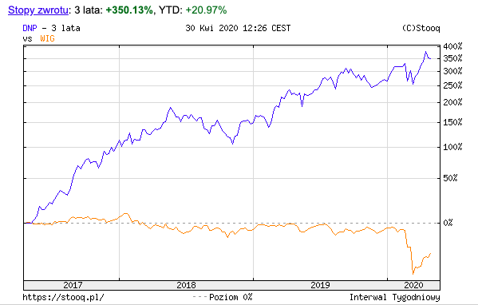

```{r include = FALSE}
library('tidyverse')
library('readxl')
library('knitr')
library('kableExtra')
```

## Agenda
## Dino Polska S.A.
<section>
  <section>
    
    
  </section>
  <section>
  
  Polska sieć sklepów spożywczo-przemysłowych założona w 1999 przez Tomasza Biernackiego.

  > - Dino to wiodący gracz w segmencie średniej wielkości.
  > - W ciągu ostatnich lat sieć Dino rozwijała się dynamicznie - liczba sklepów wzrosła ze **111** na koniec 2010 r. do **1218** na koniec 2019r.
  > - Markety są zlokalizowane głównie w mniejszych miejscowościach, małych i średnich miastach oraz na peryferiach dużych miast.

  </section>
</section>

<div class="notes">
- Dino Polska S.A. – polska sieć sklepów spożywczo-przemysłowych założona w 1999 przez Tomasza Biernackiego.
- Ich szybki wzrost pokazuje, że w małych miasteczkach potrzebny był tego rodzaju supermarket.
</div>

## Historia rozwoju

> - **Faza 1**
> - 1999 : Pierwsze sklep pod marką dino
> - 2002 : Pierwsze centrum dystrybucyjne
> - 2003 : Dino zacieśnia relacje z zakadami mięsnymi Agro-Rydzyna
> - 2004-2009 : Rozwój wokół centrum dystrybucyjnego
> - 2010 : 100 Sklepów i okres dynamicznej ekspansji
> - **Faza 2**
> - 2013 : 300 sklepów i drugie centrum Dystrybucyjne
> - 2014 - 2015 : 500 sklepów 
> - 2016 : 10,000 pracaowników i trzecie centrum Dystrybucyjne
> - 2017 : Debiut na GPW
> - 2018 : 202 otwarcia nowych marketów
> - 2019 : 243 nowe markety

<div class="notes">
- mamy 2 fazy ekspansji
- w województwie wielkopolskim powstał pierwszy sklep pod marką Supermarket Dino.
- centrum dystrybucyjne w Krotoszynie
- teraz pokazują, że Agro-Rydzyna jest spółką zależną będącą w pełni własnością (100% jednostka zależna). Agro-Rydzyna zaopatruje nasze sklepy w świeże mięso i wędliny
- Faza 2: W 2010 r. firma private equity, Enterprise Investors, pośrednio nabył 49% udziałów w Grupie Dino stając się inwestorem mniejszościowym. Kapitał na rozwój, który w ten sposób Dino pozyskal stał się katalizatorem szybkiego rozwoju w kolejnych latach. Rok 2011, przekształcił się w spółkę akcyjną.
- 2017: Enterprise Investors, sprzedał wszystkie posiadane akcje Dino (49% udziałów) na Giełdzie Papierów Wartościowych w Warszawie. IPO
</div>

## Wzrost liczby sklepów

<section>
  
  
</section>

- Szybko rozwijająca się firma
- Przyszły rozwój: polska wschodnia, międzynarodowa, online?

<div class="notes">
Spójrzmy na ich wzrost.

To jest wykres ich wzrostu w fazie 2

Nadal mogą rosnąć w tych zielonych obszarach.

Należy również zauważyć, że uniknęli bezpośredniej konkurencji ze strony większych supermarketów w dużych miastach. Koncentrują się na małych miastach. To pozwoliło im rosnąć i rozwijać się przez wiele lat. Dobra strategia.
</div>

## Akcjonariat


<small>
* Każda akcja Dino Polska S.A. uprawnia do wykonywania jednego głosu na walnym zgromadzeniu
</small>

<div class="notes">
- Jak widać, założyciel nadal kontroluje większość udziałów w spółce. 
- Ma to wpływ na ład korporacyjny. Z powodu strukturę akcjonariatu, zarządu i innych akcjonariuszy  mają bardzo mało władzy. Założyciel zasadniczo decyduje o wszystkich najważniejszych decyzjach, takich jak to, jak szybko wzrośnie, ile dywidendy do wypłaty, ile reinwestować, fuzje i przejęcia i tak dalej.

- Zanim przejrzymy sprawozdania finansowe, spróbujmy zrozumieć biznes supermarketów i jak zarabiają pieniądze. Pomoże nam dowiedzieć się, które wskażniki są ważne. Dobrze jest również wiedzieć, kto jest ich bezpośrednią konkurencją, abyśmy mogli porównać. 
</div>

## Model biznesowy


- 1218 sklepów
- 4 cztera dystrybucyjne

<div class="notes">
Supermarket jest przedsiębiorstwem świadczącym usługi.
Należy zauważyć, że supermarket jest przedsiębiorstwem usługowym.
Nie wytwarzają fizycznego
własny produkt w zwykłym znaczeniu.
Zamiast tego dodaje wartość, nabywając istniejące produkty od
dostawców, gromadząc je w regionalnych magazynach, dystrybuując je do lokalnych
sklepy, a na koniec sprzedaż produktów lokalnym klientom.

Mają 4 centra dystrybucyjne i realizowali udany rozwój sieci wokół własnego centrum dystrybucyjnego.
Potrzebują więcej centrów dystrybucyjnych, aby rosnąć we wschodniej Polsce.

</div>
## Cechy

>- Niskie **marża zysku netto** (< 5%)
>    - dlaczego?
>- Wysoki **wielkości** sprzedaży
>    - Wskaźnik cyklu zapasów, Wskaźnik rentowności sprzedaży
>- Wysoki poziom środków trwałych (**przemysł kapitałochłonny**)
>    - leasing operacyjny? nieruchomości?
>- Szybko rozwijająca się firma (high growth company)
>    - Wydatki z działalności inwestycyjnej
>    - Zwrot z kapitału własnego (ROE), Zwrot z aktywów (ROA)
>    - W jaki sposób finansują nowe sklepy?
>        1. Sprzedaż nowych akcji?
>        2. Poprzez zyzki zatrzymane (zyzk z działalności operacyjnej)?
>        3. Emitować obligacje lub zaciągać kredyt? (wskaźnik zdolności kredytowej)

<div class="notes">
Cechy
netto ze sprzedaży
niskie **marża zysku netto** (mniej niż 5%)
(Marża zysku netto = profit margin on sales)
obliczamy to dzieląc zysk netto z przychodów netto ze sprzedaży
Ale, nawet jeśli weźmie się pod uwagę marżę zysku brutto, nawet to nie jest bardzo wysokie.
Dlaczego?
  - typowe dla supermarketów, taka jest specyfika branży
  - klienci oczekują niskich cen artykułów codziennego użytku. to nie są produkty luksusowe.
  - supermarkety nie wytwarzają produktów. po prostu agregują od zdalnych dostawców, a następnie wystawiają je na półkach. Wartość dodana jest niska.
  - dowiedziałam się że, mięso i warzywa mają wyższą marżę niż produkty suche. Przypomnij sobie, że Dino jest właścicielem Agro-Rydzina, zakład mięsny, które zaopatrują sklepy w mięso i wędliny. zapewnia to nie tylko niezawodną dostawę, ale także uzyskanie wysokiej marży.

- wysoki **wielkości** sprzedaży
- To, czego brakuje im w marży zisku, kompensują wysoką wielkośią sprzedaży.
- typowy klient może kupić średio 10 produktów na wizytę
- dlatego zapewniają duży wózek na zakupy

- przemysł kapitałochłonny
- będziemy o tym pamiętać, keidy omawiamy wskaźniki, np. Wskaźnik rotacji aktywów

- czasami wysoki poziom zadłużenia (zobowiązania z tytułu leasingu)
- czy sklepy są leasingowe czy są własnością?

- wreszcie, szybko rozwijająca się firma
- powinniśmy się spodziewać wyższe wydatki z działalności inwestycyjnej, np. Nabycie wartości niematerialnych i prawnych oraz rzeczowych aktywów trwałych
- w tej sytuacji, powinniśmy sprawdzić Zwrot z kapitału własnego (ROE), Zwrot z aktywów (ROA); Myślę, że są wysokie, ale jak wysokie? Jeśli wskaźniki te nie są wysokie, może zniszczyć wartość firmy

- w jaki sposób finansują nowe sklepy?
- sprzedaż nowych akcji?
- jest mało prawdopodobne, że zbierają pieniądze poprzez sprzedaż nowe akcji. założyciel nadal kontroluje większość udziałów w spółce (właśnie 51%). nie sądzę, żeby chciał tego zmienić
- poprzez zyzki zatrzymane (powinniśmy sprawdzić zyzk z działalności operacyjnej)? 
- w tej sytuacji, wysoka dywidenda jest mało prawdopodobna
- wrzeście, czy emitować obligacje czy zaciągać kredyt?
- możemy porównać wskaźnik zadłużenia do konkurentów
- spłata odsetek od kredytu oszczędza podatki, więc posiadanie długu nie jest złe

- mamy pewien pomysł, czego szukać w sprawozdaniach finansowych
- najpierw spójrzmy szybko na giełdie

</div>

## Konkurenci
```{r echo = FALSE}
tribble(
  ~sieć, ~`liczba sklepów w Polsce`, ~siedziba,
  "Biedronka", 3000, "Portugal",
  "Dino",1218, "Poland",
  "Lidl", 700, "Germany",
  "Stokrotka", 577, "Poland",
  "Netto", 368, "Denmark",
  "Polomarket", 280, "Poland",
  "Eurospar", 250, "Netherlands",
  "Intermarché", 230, "France",
  "Mila",187, "Poland",
  "ChataPolska", 166, "Poland",
  "Aldi",132, "Germany",
  "PiotriPaweł", 70, "Poland",
  "Arhelan", 55, "Poland",
  "Frac", 21, "Poland",
  "Auchan", 33, "France",
) %>% kable()
```

<small>żródło: Wikipedia </small>

<div class="notes">
najbliżsi konkurenci są Biedronka, Lidl, Stokrotka, pod względem liczby sklepów.
</div>

## Notowania na giełdzie


<div class="notes">
- jak widać, cena akcji szybko się pomnożyła po debiucie.
</div>

---

W porównaniu z WIG     




```{r echo = FALSE}
tribble(
  ~` `, ~`Cena-zysk (P/E)`,
  "Dino", 41.8  ,  
  "Biedronka (Jeronimo M)", 23.35,
) %>% kable() %>% kable_styling()
```

<div class="notes">
- wygląda na to, że koronawirus nie wpłynął na wydajność
- Tego można było się spodziewać, ludzie nadal muszą jeść
- To nie jest cykliczny biznes. depresja ekonomiczna nie wpłynie.

- how many stores can they open?
- ROE?
- country risk?

</div>

---

```{r echo = FALSE}
dino_gr <- tribble(
  ~rok, ~kurs, ~`przychody ze sprzedaży`, ~`zysk netto`, ~`dług netto`, ~`liczba sklepów`,
  "2017",   78.80, 4462.8, 213.6, 485, 775,
  "2018",   95.85, 5838.5, 307.5, 566, 977,
  "2019",   143.90, 7646.5, 410.9, 749, 1218,
) 
dino_gr %>% kable() %>% kable_styling()
```

<div class="notes">

Jak widać, przychody ze sprzedaży prawie się podwoił, chociaż 'przychody ze sprzedaży' rośnie mniej niż zysk netto. Dług netto wrósł o prawie 55%. 
</div>

---

```{r echo = FALSE}
library('formattable')
mtcars[1:5, 1:4] %>%
  mutate(
    car = row.names(.),
    mpg = color_tile("white", "orange")(mpg),
    cyl = cell_spec(cyl, "html", angle = (1:5)*60, 
                    background = "red", color = "white", align = "center"),
    disp = ifelse(disp > 200,
                  cell_spec(disp, "html", color = "green", bold = T),
                  cell_spec(disp, "html", color = "red", italic = T)),
    hp = color_bar("green")(hp)
  ) %>%
  select(car, everything()) %>%
  kable("html", escape = F) %>%
  kable_styling("hover", full_width = F) %>%
  column_spec(5, width = "3cm") %>%
  add_header_above(c(" ", "Hello" = 2, "World" = 2))
```


## Analiza pionowa i pozioma
## Analiza wskaźnikowa


## Slide with Bullets

```{r echo = FALSE}
iris[1:10, ] %>%
  mutate_if(is.numeric, function(x) {
    cell_spec(x, bold = T, 
              color = spec_color(x, end = 0.9),
              font_size = spec_font_size(x))
  }) %>%
  mutate(Species = cell_spec(
    Species, color = "white", bold = T,
    background = spec_color(1:10, end = 0.9, option = "A", direction = -1)
  )) %>%
  kable(escape = F, align = "c") %>%
  kable_styling(c("striped", "condensed"), full_width = F)
```

---

```{r echo = FALSE}
dt <- mtcars[1:5, 1:6]
kable(dt) %>%
  kable_styling("striped", full_width = F) %>%
  column_spec(5:7, bold = T) %>%
  row_spec(3:5, bold = T, color = "white", background = "#D7261E")
```


## Slide with R Code and Output

```{r}
summary(cars)
```

## Slide with Plot

```{r, echo=FALSE}
plot(cars)
```

