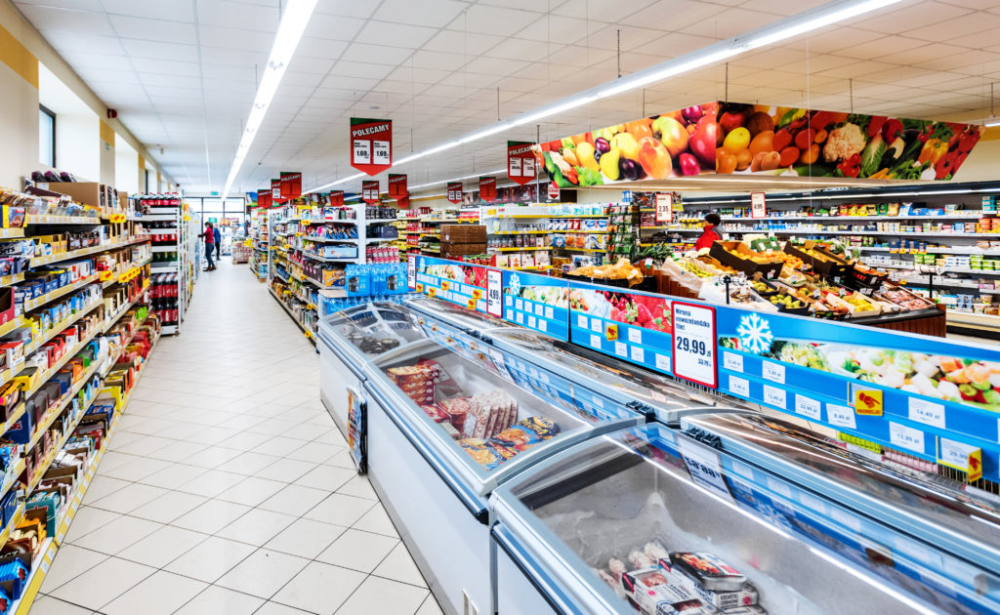
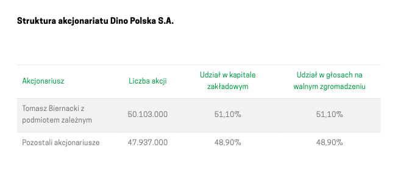

```{r include = FALSE}
library('tidyverse')
library('readxl')
library('knitr')
library('kableExtra')
```

## Agenda
## Dino Polska S.A.
<section>
  <section>
    
    
  </section>
  <section>
  
  Polska sieć sklepów spożywczo-przemysłowych założona w 1999 przez Tomasza Biernackiego.

  > - Dino to wiodący gracz w segmencie średniej wielkości.
  > - W ciągu ostatnich lat sieć Dino rozwijała się dynamicznie - liczba sklepów wzrosła ze **111** na koniec 2010 r. do **1218** na koniec 2019r.
  > - Markety są zlokalizowane głównie w mniejszych miejscowościach, małych i średnich miastach oraz na peryferiach dużych miast.

  </section>
</section>

<div class="notes">
- Dino Polska S.A. – polska sieć sklepów spożywczo-przemysłowych założona w 1999 przez Tomasza Biernackiego.
- Ich szybki wzrost pokazuje, że w małych miasteczkach potrzebny był tego rodzaju supermarket.
</div>

## Historia rozwoju

> - **Faza 1**
> - 1999 : Pierwsze sklep pod marką dino
> - 2002 : Pierwsze centrum dystrybucyjne
> - 2003 : Dino zacieśnia relacje z zakadami mięsnymi Agro-Rydzyna
> - 2004-2009 : Rozwój wokół centrum dystrybucyjnego
> - 2010 : 100 Sklepów i okres dynamicznej ekspansji
> - **Faza 2**
> - 2013 : 300 sklepów i drugie centrum Dystrybucyjne
> - 2014 - 2015 : 500 sklepów 
> - 2016 : 10,000 pracaowników i trzecie centrum Dystrybucyjne
> - 2017 : Debiut na GPW
> - 2018 : 202 otwarcia nowych marketów
> - 2019 : 243 nowe markety

<div class="notes">
- mamy 2 fazy ekspansji
- w województwie wielkopolskim powstał pierwszy sklep pod marką Supermarket Dino.
- centrum dystrybucyjne w Krotoszynie
- teraz pokazują, że Agro-Rydzyna jest spółką zależną będącą w pełni własnością. Agro-Rydzyna zaopatruje nasze sklepy w świeże mięso i wędliny
- Faza 2: W 2010 r. firma private equity, Enterprise Investors, pośrednio nabył 49% udziałów w Grupie Dino stając się inwestorem mniejszościowym. Kapitał na rozwój, który w ten sposób Dino pozyskal stał się katalizatorem szybkiego rozwoju w kolejnych latach. Rok 2011, przekształcił się w spółkę akcyjną.
- 2017: Enterprise Investors, sprzedał wszystkie posiadane akcje Dino (49% udziałów) na Giełdzie Papierów Wartościowych w Warszawie. IPO
</div>

## Wzrost liczby sklepów

<section>
  
  
</section>

- Szybko rozwijająca się firma
- Przyszły rozwój: polska wschodnia, międzynarodowa, online?

<div class="notes">
Spójrzmy na ich wzrost.

To jest wykres ich wzrostu w fazie 2

Nadal mogą rosnąć w tych zielonych obszarach.

Należy również zauważyć, że uniknęli bezpośredniej konkurencji ze strony większych supermarketów w dużych miastach. Koncentrują się na małych miastach. To pozwoliło im rosnąć i rozwijać się przez wiele lat. Dobra strategia.
</div>

## Akcjonariat



<small>
* Każda akcja Dino Polska S.A. uprawnia do wykonywania jednego głosu na walnym zgromadzeniu
</small>

<div class="notes">
- Jak widać, założyciel nadal kontroluje większość udziałów w spółce. 
- Ma to wpływ na ład korporacyjny. Z powodu strukturę akcjonariatu, zarządu i innych akcjonariuszy  mają bardzo mało władzy. Założyciel zasadniczo decyduje o wszystkich najważniejszych decyzjach, takich jak to, jak szybko wzrośnie, ile dywidendy do wypłaty, ile reinwestować, fuzje i przejęcia i tak dalej.

- Zanim przejrzymy sprawozdania finansowe, spróbujmy zrozumieć biznes supermarketów i jak zarabiają pieniądze. Pomoże nam dowiedzieć się, które wskażniki są ważne. Dobrze jest również wiedzieć, kto jest ich bezpośrednią konkurencją, abyśmy mogli porównać. 
</div>

## Model biznesowy


<div class="fragment">
**Cechy:**
</div>
>- Niskie **marża zysku netto** (< 5%)
>    - dlaczego?
>- Wysoki **wielkości** sprzedaży
>    - Wskaźnik cyklu zapasów, Wskaźnik rentowności sprzedaży
>- Wysoki poziom środków trwałych (**przemysł kapitałochłonny**)
>    - leasing operacyjny? nieruchomości?
>- Szybko rozwijająca się firma (high growth company)
>    - how?

<div class="notes">
Supermarket jest przedsiębiorstwem świadczącym usługi.
Należy zauważyć, że supermarket jest przedsiębiorstwem usługowym.
Nie wytwarzają fizycznego
własny produkt w zwykłym znaczeniu.
Zamiast tego dodaje wartość, nabywając istniejące produkty od
dostawców, gromadząc je w regionalnych magazynach, dystrybuując je do lokalnych
sklepy, a na koniec sprzedaż produktów lokalnym klientom.

Mają 4 centra dystrybucyjne i realizowali udany rozwój sieci wokół własnego centrum dystrybucyjnego.
Potrzebują więcej centrów dystrybucyjnych, aby rosnąć we wschodniej Polsce.

Cechy
netto ze sprzedaży
niskie **marża zysku netto** (mniej niż 5%)
(Marża zysku netto = profit margin on sales)
obliczamy to dzieląc zysk netto z przychodów netto ze sprzedaży
Ale, nawet jeśli weźmie się pod uwagę marżę zysku brutto, nawet to nie jest bardzo wysokie.
Dlaczego?
  - typowe dla supermarketów, taka jest specyfika branży
  - klienci oczekują niskich cen artykułów codziennego użytku. to nie są produkty luksusowe.
  - supermarkety nie wytwarzają produktów. po prostu agregują od zdalnych dostawców, a następnie wystawiają je na półkach. Wartość dodana jest niska.
  - dowiedziałam się że, mięso i warzywa mają wyższą marżę niż produkty suche. Przypomnij sobie, że Dino jest właścicielem Agro-Rydzina, zakład mięsny, które zaopatrują sklepy w mięso i wędliny. zapewnia to nie tylko niezawodną dostawę, ale także uzyskanie wysokiej marży.

- wysoki **wielkości** sprzedaży
- To, czego brakuje im w marży zisku, kompensują wysoką wielkośią sprzedaży.
- typowy klient może kupić średio 10 produktów na wizytę
- dlatego zapewniają duży wózek na zakupy

- przemysł kapitałochłonny
- będziemy o tym pamiętać, keidy omawiamy wskaźniki, np. Wskaźnik rotacji aktywów

- czasami wysoki poziom zadłużenia (zobowiązania z tytułu leasingu)
- czy sklepy są leasingowe czy są własnością?

- wreszcie, szybko rozwijająca się firma

</div>

## Notowania na giełdzie


```{r echo = FALSE}
tribble(
  ~rok, ~kurs, 
  "2017",   78.80,
  "2018",   95.85,
  "2019",   143.90
) %>% mutate(y = ifelse(kurs==78.80, 39.39, lag(kurs))) %>% 
  mutate(`stopa zwrotu z akcji` = str_c(as.integer((kurs-y)/y*100), ' %')) %>% select(-y) %>% 
  group_by_all() %>% 
  kable() %>% 
  add_header_above(c(" " = 1, "Debiut @ 39.39" = 2))
```


<div class="notes">
- jak widać, cena akcji szybko się pomnożyła po debiucie.

</div>


## Analiza pionowa i pozioma
## Analiza wskaźnikowa


## Slide with Bullets

- Bullet 1
- Bullet 2
- Bullet 3

## Slide with R Code and Output

```{r}
summary(cars)
```

## Slide with Plot

```{r, echo=FALSE}
plot(cars)
```

