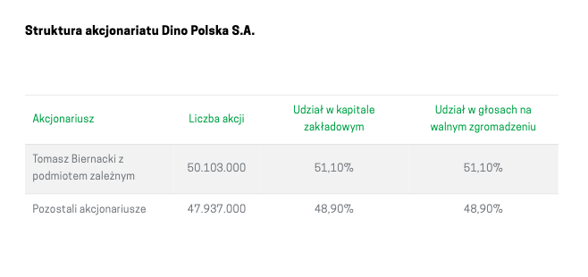
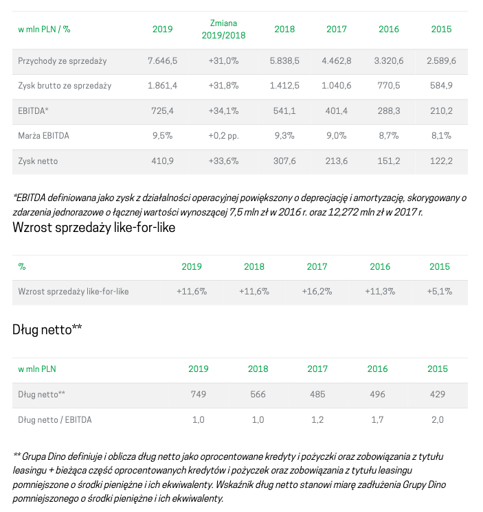
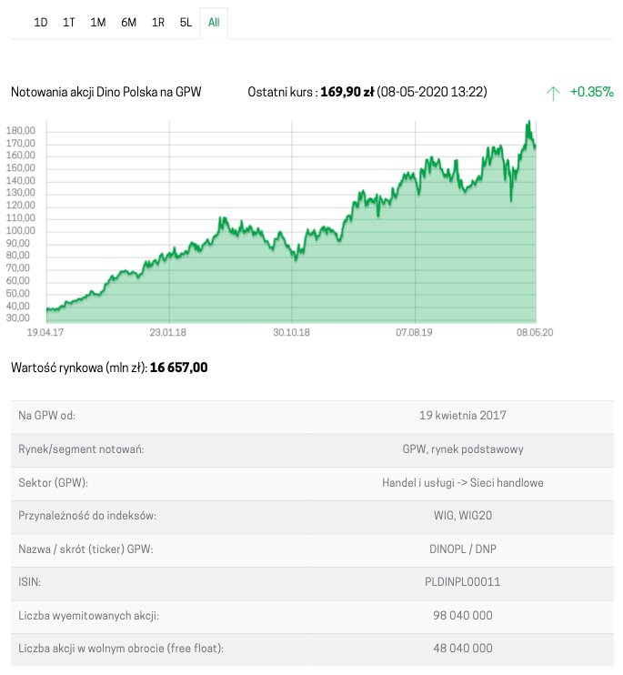
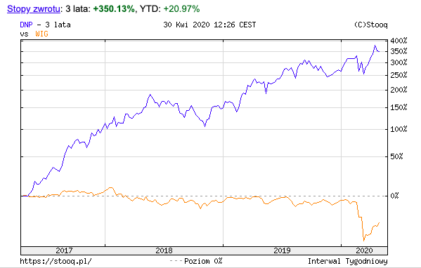
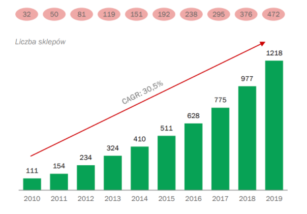

```{r global_options, include=FALSE}
library('tidyverse')
library('knitr')
library('kableExtra')
#source(file = 'bilans.R')
#source(file = 'rzis.R')
source(file = 'wskazniki.R')

#knitr::opts_chunk$set(fig.width=12, fig.height=8, fig.path='Figs/',
knitr::opts_chunk$set(echo=FALSE, warning=FALSE, message=FALSE, results='asis')
```

```{r setup, include=FALSE}
pagebreak <- function() {
  if(knitr::is_latex_output())
    return("\\newpage")
  else {
    return('<hr style="height:1px;border:none;color:#333;background-color:#333;" /> <div style="page-break-before: always;" />')
  }
}

select_rows <- function(tabl, pattern_r) {
    return(na.omit(tabl %>% 
                   select(1) %>% 
                   mutate_at(vars(1), ~ ifelse(str_detect(.x, pattern_r), row_number(), NA)) %>% 
                   unlist(., use.names=FALSE)))
}

#mycolor <- "#F0F8FF"
mycolor <- "#FFF5D3"
#mycolor <- "#FFFB89"

```

`r pagebreak()`

## 1 Dane spółki, charakterystyka, notowania

Spółka [Dino](https://grupadino.pl) to Polska sieć handlu spożywczego założona w 1999 roku przez Tomasza Biernackiego. Jest to wiodący gracz w rosnącym segmencie średniej wielkości supermarketów w Polsce, zlokalizowanych głównie w mniejszych miejscowościach, małych i średnich
miastach oraz na peryferiach dużych miast. W latach 2010-2019 liczba sklepów wzrosła ze 111 na koniec 2010 do 1218 na koniec 2019 roku.

* **Zarząd Spółki**: Szymon Piduch – Prezes Zarządu, Michał Krauze – Członek Zarządu, Dyrektor Finansowy, Michał Muskała – Członek Zarządu, Dyrektor Inwestycji
* **Rada Nadzorcza**: Tomasz Biernacki - przewodniczący rady nadzorczej, Eryk Bajer - członek rady nadzorczej, Sławomir Jakszuk - niezależny członek rady nadzorczej, Piotr Nowjalis - niezależny członek rady nadzorczej, Maciej Polanowski - członek rady nadzorczej
* **Siedziba Spółki**: ul. Ostrowska 122, 63-700 Krotoszyn, Polska
* **Komitet audytu**: Piotr Nowjalis – przewodniczący komitetu audytu, Sławomir Jakszuk – członek komitetu audytu, Maciej Polanowski – członek komitetu audytu

### 1.1 Historia rozwoju

Grupa Dino jest jedną z najszybciej rozwijających się sieci supermarketów *proximity* w Polsce – zarówno pod względem liczby sklepów, jak i przychodów ze sprzedaży.

Poniżej przedstawiamy wydarzenia, które odegrały ważną rolę w jej historii.

- 1999 : Pierwsze sklep pod marką Dino
- 2002 : Pierwsze centrum dystrybucyjne
- 2003 : Dino zacieśnia relacje z zakładami mięsnymi Agro-Rydzyna
- 2004-2009 : Rozwój wokół centrum dystrybucyjnego
- 2010 : 100 Sklepów i okres dynamicznej ekspansji
- 2013 : 300 sklepów i drugie centrum Dystrybucyjne
- 2014 - 2015 : 500 sklepów 
- 2016 : 10,000 pracowników i trzecie centrum Dystrybucyjne
- 2017 : Debiut na GPW
- 2018 : 202 otwarcia nowych marketów
- 2019 : 243 nowe markety


### 1.2 Akcjonariat

{ width=70% }

Każda akcja Dino Polska S.A. uprawnia do wykonywania jednego głosu na walnym zgromadzeniu.

Ponad 50% udziałów należy do założyciela spółki.

### 1.3 Wybrane dane finansowe {#wdf}

{ width=100% }


### 1.4 Notowania giełdowe spółki

{ width=60% }

Kurs odniesienia spółki Grupa Dino 8 maja wynosiła 169,90 zł. 

Od debiutu w GPW zauważalny jest widoczny trend wznoszący wskazujący apetyt inwestorów na spółki najszybciej rozwijające się.

#### 1.4.1 Cena akcji w porównaniu z WIG
<small>(na niebiesko: Dino, na żółto: WIG)</small>

{ width=60% }

Na wykresie widzimy wyraźny wzrost cen akcji Dino Polska w porównaniu z WIG.
Sytuacja związana z koronawirusem jedynie chwilowo wpłynęła na spadek
wartości akcji, po czym, znów nastąpił wzrost.

Supermarkety nie należą do rodzaju spółek cyklicznych, a więć
koniunktura gospodarcza nie ma większego wpływu na 
działalność.

### 1.5 Konkurencja

Biedronka (Jeronimo Martins) i Lidl są najbliższymi konkurentami pod względem 
wielkości sklepów, ale Stokrotka i Polomarket to polskie firmy.

Stokrotka jest firmą franczyzową, a zarówno Stokrotka, jak i Polomarket to firmy prywatne. 
Nie publikują sprawozdań finansowych, a to, co podają o Ministerstwo Sprawiedliwości, 
jest sporządzony niezgodnie z MSR.

Z tych powodów porównamy spółka Dino do Biedronki (Jeronimo Martins).

Jeronimo Martins jest portugalską firmą działającą w Polsce, Portugalii i Kolumbii. 
Większość operacji odbywa się w Polsce i Portugalii. 95% jej działalności pochodzi 
z supermarketów (retail) i powiązanej dystrybucji żywności.

```{r}
tribble(
  ~Sieć, ~`Liczba sklepów w Polsce`, ~Siedziba,
  "Biedronka", 3000, "Portugalia",
  "Dino",1218, "Polska",
  "Lidl", 700, "Niemcy",
  "Stokrotka", 577, "Polska",
  "Netto", 368, "Dania",
  "Polomarket", 280, "Polska",
  "Eurospar", 250, "Holandia",
  "Intermarché", 230, "Francja",
  "Mila",187, "Polska",
  "ChataPolska", 166, "Polska",
  "Aldi",132, "Niemcy",
  "PiotriPaweł", 70, "Polska",
  "Arhelan", 55, "Polska",
  "Frac", 21, "Polska",
  "Auchan", 33, "Francja",
) %>% kable(booktabs = T,
            caption = "Konkurencja") %>% 
  kable_styling(latex_options = c("striped"),
                bootstrap_options = c("striped", "condensed")) %>% 
  footnote(general = "Żródło: Wikipedia", general_title = "")

```

`r pagebreak()`

## 2 Wstępna analiza bilansu

Naszym celem badania bilansu jest poznanie kondycji spółki.

### 2.1 Analiza pionowa bilansu

Zdecydowana większość aktywów (około 70%) to aktywa trwałe, w szczególności środki trwałe i inwestycje długoterminowe w Agro-Rydzyna, jednostki powiązanej. Obecność znaczących niepłynnych aktywów to typowe dla  spółki z branży supermarketów, który nie opiera się na modelu franczyzy. 

Zapasy stanowią około 50% aktywów obrotowych. Również, spółka posiada mniej środki pieniężne i inne aktywa pieniężne.

Jeśli chodzi o pasywa, kapitał własny rośnie z każdym rokiem, ponieważ cały zysku netto
(z każdym rokiem) jest inwestowany w spółkę. Fakt ten znajduje odzwierciedlenie w pozycji
A.II i A.IV. A.II wskazuje zakumulowaną kwotę reinwestycji zysku roku ubiegłego, a A.IV 
jest zyskiem roku danego.

Następujące informacje podano w sprawozdaniu finansowym:     

>12.1. Podział zysku za rok poprzedni:
>Zwyczajne Walne Zgromadzenie Akcjonariuszy, które odbyło się w dniu 13 czerwca 2019 roku podjęło uchwałę o przeznaczeniu zysku za rok poprzedni na kapitał zapasowy.

Tego należy się spodziewać, ponieważ 
wypłacanie dywidend byłoby nieefektywne. Jest to szybko rozwijająca się spółka, 
która potrzebuje inwestycji w nowe sklepy i centra dystrybucyjne.

Zobowiązania ogółem jest ponad 2 razy wyższa niż zarówno aktywa obrotowe jak i kapitał własny. 

Zobowiązania krótkoterminowe, większość to zobowiązania z tytułu dostaw i usług (Załącznik: pozycja B.III.3.d w  bilansie), stanowią około 70% z zobowiązań.

Zobowiązania ogółem wzrósł nieznacznie od 2017 do 2018 w stosunku do kapitałów własnych.


```{r}
bil <- bind_rows(aktywa_st, pasywa_st)
bil %>% 
  select(!matches('15|16|_sk')) %>% 
  filter_at(vars(1), ~ str_detect(.x, '^[VIABP]')) %>% 
  kable(escape = F,
        caption = "Analiza pionowa bilansu",
        col.names = c("Elementy bilansu", '2017', '2018', '2019', '2017', 
                                  '2018', '2019', '2017', '2018', '2019'),
        align=c("l",rep("r",9)),
        booktabs=TRUE) %>% 
  kable_styling(latex_options = c("striped"),
                bootstrap_options = c("striped", "hover", "condensed")) %>% 
  add_header_above(c(" " = 1, "Stan na koniec roku (w.tys.zł.)" = 3, 
                     "Struktura (w%)" = 3, "Str. wewn. (w%)" = 3)) %>% 
  row_spec(c(1, 7, 12, 13, 22, 27), bold = T) %>% 
  row_spec(c(2:6, 8:11, 14:21, 23:26), italic = T) %>% 
  column_spec(5:7, background = mycolor) %>% 
  row_spec(12, hline_after = T)

```


### 2.2 Analiza pozioma bilansu


Zarówno aktywa trwałe i obrotowe rosną o około 30% z roku na rok. Kapitał własne rośnie również w podobnym tempie, co wskazuje na zrównoważony wzrost.

Zobowiązania wzrosły o ponad 30% z roku na rok, jednak zysk netto wrósł również o 50% z roku na rok.

```{r}
col_names <- c("Elementy bilansu", '2017', '2018', '2019', '2018', '2019',
               '2017/18', '2018/19', '2017/18', '2018/19')
bil <- bind_rows(aktywa, pasywa)
bil %>% 
  select_at(vars(1, 4:6, 9:10, 13:14, 17:18)) %>%
  filter_at(vars(1), ~ str_detect(.x, '^[VIABP]')) %>% 
  kable(escape = F, col.names = col_names, booktabs = T,
        caption = "Analiza pozioma bilansu",
        align=c("l",rep("r",9))) %>% 
  kable_styling(latex_options = c("striped", "scale_down"),
                bootstrap_options = c("striped", "hover", "condensed")) %>% 
  add_header_above(c(" " = 1, "Ceny bieżące" = 3, "Ceny skorygowane" = 2, 
                     "W cenach bieżących" = 2, "W cenach skorygowanych" = 2)) %>% 
  add_header_above(c(" " = 1, "Stan na koniec roku (w. tys. zł.)" = 5, 
                     "Dynamika (w%)" = 4)) %>% 
  row_spec(c(1, 7, 12, 13, 22, 27), bold = T) %>% 
  row_spec(c(2:6, 8:11, 14:21, 23:26), italic = T) %>% 
  row_spec(12, hline_after = T) %>% 
  column_spec(c(5:6, 9:10), background = mycolor)
```

`r pagebreak()`

### 2.3 Kapitał obrotowy netto

Ujemna wartość kapitału obrotowego netto w obu latach wskazuję na to, iż całość aktywów bieżących finansowana jest ze zobowiązań bieżących, a to oznacza, że w przedsiębiorstwie nie występuje kapitał obrotowy netto.

W związku z ujemnymi wartościami kapitału obrotowego netto w badanych latach nie obliczamy w naszym sprawozdaniu **udziału kapitału obrotowego netto w finansowaniu aktywów ogółem** oraz **udziału kapitału obrotowego netto w finansowaniu aktywów obrotowych przedsiębiorstwa**.

Kapitał obrotowy netto w obu latach był ujemny.

```{r}
kon <- tribble(
  ~" ", ~"2018", ~"2019", ~"2018_s", ~"2019_s",
  'Kapitał stały', '', '', '', '',
  '1. Kapitał własny', '', '', '', '', 
  '2. Rezerwy długoterminowe', '', '', '', '', 
  '3. Zobowiązania długoterminowe ', '', '', '', '', 
  'Kapitał stały ogółem', '', '', '', '', 
  'Aktywa stałe', '', '', '', '',
  'Aktywa stałe ogółem', '', '', '', '',
  'Aktywa bieżące', '', '', '', '',
  'Aktywa bieżące ogółem', '', '', '', '',
  'Zobowiązania bieżące', '', '', '', '',
  'Rezerwy na zobowiązania krótkoterminowe', '', '', '', '',
  'Rozliczenia międzyokresowe krótkoterminow', '', '', '', '',
  'Zobowiązania bieżące ogółem', '', '', '', '',
  'Kapitał stały', '', '', '', '',
  'Aktywa stałe', '', '', '', '',
  'Kapitał obrotowy netto', '', '', '', '',
)

g <- function(tabl, rw, yr) {
  n <- (tabl %>% slice(rw) %>% select(yr))[[1]]
  return(if_else(is.na(as.numeric(n)), 0, as.numeric(n)))  
}

kap_ob_n <- function(kon, col_n, yr) {
  
  kon <- kon %>% 
    mutate_at(vars(col_n), ~ ifelse(row_number() == 2, g(pasywa, 1, yr), as.character(.x))) %>% 
    mutate_at(vars(col_n), ~ ifelse(row_number() == 3, g(pasywa, 12, yr), as.character(.x))) %>% 
    mutate_at(vars(col_n), ~ ifelse(row_number() == 4, g(pasywa, 16, yr), as.character(.x))) %>% 
    mutate_at(vars(col_n), ~ ifelse(row_number() == 5, 
                                g(pasywa, 1, yr) +
                                  g(pasywa, 12, yr) +
                                  g(pasywa, 16, yr), as.character(.x))) %>% 
    mutate_at(vars(col_n), ~ ifelse(row_number() == 6, g(aktywa, 1, yr), as.character(.x))) %>% 
    mutate_at(vars(col_n), ~ ifelse(row_number() == 7, g(aktywa, 1, yr), as.character(.x))) %>% 
    mutate_at(vars(col_n), ~ ifelse(row_number() == 8, g(aktywa, 21, yr), as.character(.x))) %>% 
    mutate_at(vars(col_n), ~ ifelse(row_number() == 9, g(aktywa, 21, yr), as.character(.x))) %>% 
    mutate_at(vars(col_n), ~ ifelse(row_number() == 10, g(pasywa, 23, yr), as.character(.x))) %>% 
    mutate_at(vars(col_n), ~ ifelse(row_number() == 11, '0', as.character(.x))) %>% 
    mutate_at(vars(col_n), ~ ifelse(row_number() == 12, g(pasywa, 44, yr), as.character(.x))) %>% 
    mutate_at(vars(col_n), ~ ifelse(row_number() == 13, 
                                g(pasywa, 23, yr) + 
                                  g(pasywa, 44, yr), as.character(.x))) 
  
  kon <- kon %>% 
    mutate_at(vars(col_n), ~ ifelse(row_number() == 14, g(kon, 5, yr), as.character(.x))) %>%
    mutate_at(vars(col_n), ~ ifelse(row_number() == 15, g(kon, 7, yr), as.character(.x))) %>% 
    mutate_at(vars(col_n), ~ ifelse(row_number() == 16, g(kon, 5, yr) - 
                                  g(kon, 7, yr), as.character(.x)))
  
  return(kon)
}
 
kon <- kap_ob_n(kon, 2, '2018')
kon <- kap_ob_n(kon, 3, '2019')

kon <- kon %>% 
  mutate_at(vars(4), ~ ifelse(row_number() %in% c(2:5), 
                                    round(g(kon, row_number(), '2018') / 
                                            g(kon, 5, '2018') * 100, 
                                          digits=1), as.character(.x))) %>% 
  mutate_at(vars(5), ~ ifelse(row_number() %in% c(2:5), 
                                    round(g(kon, row_number(), '2019') / 
                                            g(kon, 5, '2019') * 100, 
                                          digits=1), as.character(.x)))

```

```{r}
col_names <- c("", '2018', '2019', '2018', '2019')

kon %>% 
  kable(escape = F, col.names = col_names, booktabs = T,
        caption = "Kapitał obrotowy netto",
        align=c("l",rep("r",4))) %>% 
  kable_styling(latex_options = c("striped", "hold_position"),
                bootstrap_options = c("striped", "hover", "condensed"),
                full_width = F) %>% 
  add_header_above(c("Wyszczególnienie" = 1, "Wartość(w tys.zł.)" = 2, 
                     "Struktura kapitałów stałych (w %)" = 2)) %>%
  row_spec(c(5, 7, 9, 13, 16), bold = T)

```

`r pagebreak()`

### 2.3 Analiza wskażnikowa

```{r}
wskaźniki <- wskaźniki_bilans()

wsk_disp <- function(wsk, rown) {
  return (wsk %>% 
            slice(rown) %>% 
            select(-1) %>% 
            kable(booktabs = T) %>%
            kable_styling(c("striped", "condensed"), full_width = F) %>% 
            row_spec(c(1), color = "#8B0000"))
}
```

#### 2.2.1 Wskaźnik pokrycia aktywów trwałych kapitałem własnym
     
$$\small \frac{Kapitał\ własny}{Aktywa\ trwałe} * 100$$

`r wsk_disp(wskaźniki, 1)`

Wskaźnik ten informuje o stopniu, w jakim kapitał własny pokrywa aktywa trwałe. Zgodnie z jedną z zasad bilansowych, kapitał własny powinien wystarczać na sfinansowanie aktywów trwałych, co oznacza, że wskaźnik ten powinien przyjmować wartość co najmniej równą 100%. W przypadku spółki Dino sytuacja jest niekorzystna gdyż wartości w ciągu pięciu lat wynoszą poniżej 100%. Duża niższa wartość wskaźnika niż 100% spółka nie wskazuje mniejszą wiarygodność kredytową, tak długo, jak rosną przepływy pieniężne i zysk netto.

Spółka informuje ciągły spadek w *Dług netto / EBITDA* w [wybranych danach finansowych (1.3)](#wdf)

#### 2.2.2 Wskaźnik pokrycia aktywów trwałych kapitałem stałym
     
$$\small \frac{Kapitał\ stały}{Aktywa\ trwałe} * 100$$

`r wsk_disp(wskaźniki, 2)`

Aktywa trwałe nie są finansowane kapitałem długoterminowym. Srebrna zasada nie jest spełniona ponieważ aktywa trwałe nie są w całości finansowane przez kapitał stały. Wartość poniżej 100% może oznacza, że spółka ma małą wiarygodność kredytową.

#### 2.2.3 Wskaźnik pokrycia aktywów obrotowych zobowiązanymi krótkoterminowymi
     
$$\small \frac{Zobowiązania\ krótkoterminowe}{Aktywa\ obrotowe} * 100$$

`r wsk_disp(wskaźniki, 3)`

Wskaźnik ten pokazuję możliwości przedsiębiorstwa do regulowania zobowiązań posiadanymi środkami obrotowymi. Wartość tego wskaźnika wskazuje stabilną sytuację.

`r pagebreak()`

## 3 Wstępna analiza rachunku zysków i strat

Przychody ze sprzedaży stanowią największą część przychodów ogółem, co wynika z działalności spółki, której głównym celem jest sprzedaż dla indywidualnych osób artykułów spożywczych i dóbr używanych w gospodarstwie domowym.

Podobna sytuacja przedstawia się po stronie kosztów, tutaj również tak jak w przypadku przychodów największe koszty występują jako koszty sprzedanych produktów, towarów i materiałów.
 
**Zysk netto**
Zysk netto stanowi zaledwie 3-4% łącznych przychodów ze sprzedaży, co jest wyższy dla sektora detalicznego (0.5 - 3.5%). Zysk netto wzrósł około o 50% z roku na rok. Może to być spowodowane tym, że firma była w stanie znaleźć dobre lokalizacje dla nowych sklepów.

**Koszty ogólnego zarządu**
Zysk netto stanowi zaledwie 15-16% łącznych przychodów ze sprzedaży, co jest niższy dla sektora detalicznego (15 - 25%). Spółka jest zarządzana wydajnie.

**Łączne przychody ze sprzedaży**
Łączne przychody wzrosły o około 30% z roku na rok, co zasadniczo jest spowodowane wzrostem liczby sklepów, których wzrosły o około 25%. 

{ width=40% }

**Koszt własny sprzedaży**
Koszt własny sprzedaży wzrósł o podobną wartość jak łączne przychody.

**Wynik z działalności operacyjnej**
W wyniku czynników omówionych powyżej wynik z działalności operacyjnej Spółki wzrósł o 41-44%.

```{r}

mrzis %>% 
  select_at(vars(1:4, 7:9)) %>% 
  kable(escape = F,
        col.names = c("Elementy rachunku zysków i strat", 
                      '2017', '2018', '2019', 
                      '2017', '2018', '2019'),
        caption = "Analiza pionowa rachunku zysków i strat",
        align=c("l",rep("r",6)),
        booktabs=TRUE) %>% 
  kable_styling(latex_options = c("striped"),
                bootstrap_options = c("striped", "hover", "condensed")) %>% 
  add_header_above(c(" " = 1, "Wyniki finansowe (w.tys.zł.)" = 3, 
                     "Struktura (w%)" = 3)) %>% 
  column_spec(1, bold = T) %>% 
  column_spec(5:7, background = mycolor)

col_names <- c("Elementy rachunku zysków i strat", 
               '2017', '2018', '2019', '2018', '2019',
               '2017/18', '2018/19', '2017/18', '2018/19')
mrzis %>% 
  select_at(vars(1:6, 10:13)) %>% 
  kable(escape = F, col.names = col_names, booktabs = T,
         caption = "Analiza pozioma rachunku zysków i strat",
        align=c("l",rep("r",9))) %>% 
  kable_styling(latex_options = c("striped", "scale_down"),
                bootstrap_options = c("striped", "hover", "condensed")) %>% 
  add_header_above(c(" " = 1, "Ceny bieżące" = 3, "Ceny skorygowane" = 2, 
                     "W cenach bieżących" = 2, "W cenach skorygowanych" = 2)) %>% 
  add_header_above(c(" " = 1, "Wyniki finansowe (w.tys.zł.)" = 5, 
                     "Dynamika (w%)" = 4)) %>% 
  column_spec(1, bold = T) %>% 
  column_spec(c(5:6, 9:10), background = mycolor)
```


`r pagebreak()`

### 3.3 Analiza wskażnikowa

```{r}
wskaźniki <- wskaźniki_rzis()

wsk_disp <- function(wsk, item) {
  
  return (wsk %>% 
            select(c(1, as.integer(item) + 1)) %>% 
            pivot_wider(names_from = rok, values_from = !!item) %>% 
            kable(booktabs = T) %>%
            kable_styling(c("striped", "condensed"), full_width = F) %>% 
            row_spec(c(1), color = "#8B0000"))
}
```

#### 3.3.1

$$\small \frac{Zysk\ z\ działalności\ operacyjnej}{Zysk\ ze\ sprzedaży} * 100$$

`r wsk_disp(wskaźniki, '1')`

Relacja zysku z działalności operacyjnej do zysku ze sprzedaży wynosi 
ponwyżej 100% w ciągu z badanych lat. Z sprawozdaniu wynika, iż pozycja 
D.IV (Inne przychody operacyjne) jest czynnikiem przyczyniającym się.

#### 3.3.2

$$\small \frac{Zysk\ brutto}{Zysk\ z\ działalności\ operacyjnej} * 100$$

`r wsk_disp(wskaźniki, '2')`

Koszty finansowe i odsetki spowodowały różnicę między zyskiem brotto i 
z dziłalności operacyjnej. 

2016 r. jest wyjątkiem, ponieważ jednorazowo przychód finansowych 
pochodził z spółki zależnej Vitrena Holdings, jako diwidendy i udziały w zyskach.

Wzrost tej wskaźniki w ciągu ostatnich 3 lat pokazuje poprawę wydajności.

#### 3.3.3

$$\small \frac{Zysk\ brutto}{Zysk\ ze\ sprzedaży} * 100$$

`r wsk_disp(wskaźniki, '3')`

Spółka uzyskuje zysk brutto z działalności operacyjnej, a nie z działalności 
finansowej.

#### 3.3.4

$$\small \frac{Zysk\ netto}{Zysk\ ze\ sprzedaży} * 100$$

`r wsk_disp(wskaźniki, '4')`

W 2019 roku 28,6% zysku ze sprzedaży pochłonęły wyniki na pozostałym 
poziomie operacyjnym, poziomie finansowym i nadzwyczajnym oraz podatek dochodowy.


#### 3.3.5

$$\small \frac{Podatek\ dochodowy}{Zysk\ brutto} * 100$$

`r wsk_disp(wskaźniki, '5')`

Efektywna stopa opodatkowania pokazuje obciążenie zysku bieżącym i przyszłym 
podatkiem dochodowym. 
W ciągu ostatnich 3 lat efektywna stopa opodatkowania spółki była średnia dla branży.

`r pagebreak()`

## 4 Analiza rachunku przepływów pieniężnych

### 4.1 Syntetyczna analiza sald

W ciągu ostatnich pięciu lat saldo przepływów operacyjnych było dodatnie, 
w przeciwieństwie do salda przepływów inwestycyjnych które przez cały ten okres było ujemne.
Z kolei, saldo przepływów finansowych w ciągu pierwszych dwóch lat było ujemne, a
później tylko dodatnie. Na podstawie tych sald można wyciągnąć wniosek, że spółka
Dino jest przedsiębiorstwem rozwijającym się. Mimo że saldo przepływów finansowych
w latach 2015 i 2016 było ujemne, to zostało pokryte przez wysokie dodatnie 
saldo przepływów operacyjnych. 

Można zauważyć, że wysokość środków pieniężnych na koniec okresu rośnie z roku na rok.
Środki te mogą posłużyć w przyszłości jako zabezpieczenie spółki na wypadek  
kryzysu gospodarczego.


```{r}
rpp %>% 
  select(!contains('/')) %>% 
  filter_at(vars(1), ~ str_starts(.x, '[IA-Z]')) %>% 
  kable(booktabs = T, escape = F,
        caption = "Syntetyczna analiza sald",
        align=c("l",rep("r",5))) %>%
  kable_styling(latex_options = c("striped", "hold_position"),
                full_width = F,
                bootstrap_options = c("striped", "hover", "condensed")) %>%
  #row_spec(c(4, 8, 12, 16), color = "#8B0000") %>% 
  row_spec(c(1, 5, 9, 13:16), bold = T) %>% 
  row_spec(c(4, 8, 12), hline_after = T) %>% 
  add_header_above(c(" " = 1, "w tys. zl." = 5))
```

### 4.2 Analiza pionowa rachunku przepływów pieniężnych

Analizując dane z lat 2017, 2018, 2019, zysk netto stanowił kolejno ponad 31%,
33%, 45% salda przepływów operacyjnych, co pokazuje, że spółka jest w dobrej
sytuacji ekonomicznej. Amortyzacja była na poziomie około 15% w skali trzech lat.

Istotne jest, że od 1 stycznia 2019 roku, MSSF 16 zastąpił MSR 17 Leasing oraz
związane z nim interpretacje. Spółka ujawniła w sprawozdaniu finansowym
następujące informacje:

> Rachunkowość leasingodawcy zgodnie z MSSF 16 pozostaje zasadniczo niezmieniona
w stosunku do MSR 17. Leasingodawcy będą nadal klasyfikować leasing jako
operacyjny lub finansowy, stosując podobne zasady jak w MSR 17. Dlatego też MSSF
16 nie miał wpływu na te umowy leasingowe, w których Grupa jest leasingodawcą.

Krótko mówiąc, zmiany w traktowaniu leasingu dla leasingobiorcy dotyczą leasingu
finansowego, nie miały wpływu na wysokość amortyzacji (pozycja A.II.1). Także,
większość umów leasingowych to leasing finansowy.

Zmiana zapotrzebowania na kapitał obrotowy netto została wyliczona na poziomie 
minus 43%, 45%, 29%. Tak ujemne wartości mogą wynikać z rozwoju spółki.


```{r}
rpp_str %>% 
  kable(booktabs = T, escape = F, col.names = gsub("_st", "", names(rpp_str)),
        caption = "Analiza pionowa rachunku przepływów pieniężnych",
        align=c("l",rep("r",5))) %>%
  kable_styling(latex_options = c("striped", "hold_position"),
                full_width = F,
                bootstrap_options = c("striped", "hover", "condensed")) %>%
  column_spec(5:7, background = mycolor) %>% 
  add_header_above(c(" " = 1, "Wartość (w tys. zł.)" = 3, "Struktura (w %)" = 3))

```

### 4.3 Analiza pozioma rachunku przepływów pieniężnych

#### 4.3.1 Przepływy środków pieniężnych z działalności operacyjnej

W odniesieniu do pozycji A.I Zysk netto, zauważamy duży wzrost w latach 2015/2016, 
o 711% i spadek w latach 2016/17 o 50%. Dzieje się tak z powodu jednorazowych
przychodów finansowych, konkretnie dywidendy, pochodzącej od spółki zależnej
Vitrena Holdings, w wysokości 229 milionów.  Zysk netto jest niezwykle wysoki w
2016 roku. Jest to wykazane w rachunku zysków i strat. Poza tym możemy
stwierdzić, że zyski netto rosną w tempie około 50% każdego roku.

Jeśli chodzi o Odsetki i udziały w zyskach (pozycja A.3), są również skorygowane
w 2016 roku ze względu na zwrot dywidendy do spółki zależnej Vitrena Holdings.
Ta transakcja miała charakter wewnętrzny i nie powinna zwiększyć przepływów
pieniężnych.

Zmiana stanu zapasów, zmienia się wraz z rozwojem spółki. Także, amortyzacja 
rośnie w podobnym tempie każdego roku. 

Kwoty z pozycji zmiana stanu zobowiązań krótkoterminowych (A.II.8) mają duży
wpływ na saldo przepływów operacyjnych. Są to zdarzenia gospodarcze ujęte w
wyniku finansowym danego roku, mimo że płatności będą dokonywane w przyszłym
roku. W takim przypadku, wiedząc, że przez wystąpienie zobowiązania odroczony
jest termin przepływu pieniężnego w stosunku do ujawnienia kosztu, należy
dokonać korekty w rachunku przepływów pieniężnych. Znaczące dodatnie kwoty w
pozycji A.II.8 oznacza po prostu, że dostawcy zgodzili się czekać na płatności.
Wskazuje to, że Dino ma moc dyktowania warunków od dostawców.


#### 4.3.2 Przepływy pieniężne netto z działalności inwestycyjnej 

Spółka otwiera około 200 sklepów rocznie. Jest to odzwierciedlone w ujemnym 
saldzie przepływów inwestycyjnych.

Pozycja B.II.1 odzwierciedla inwestycje w rzeczowych aktywach trwałych. Pozycja
B.II.2 dotyczy inwestycji w nieruchomości, jednak kwota ta wynosi zero. Grupa
Dino składa się z 6 innych firm o nazwie ‘Centrum Wynajmu Nieruchomości 1-6
S.A.’. Kupno i sprzedaż nieruchomości, i wynajem i zarządzanie nieruchomościami
odbywa się za pośrednictwem tych firm.

W odniesieniu do pozycji b.I.3 i B.II.3 odzwierciedlają one transakcje między
główną spółką Dino a spółkami zależnymi Agro-Rydzina i Centrum Wynajmu
Nieruchomości. Sprawozdania finansowe nie wyjaśniają dokładnego charakteru tych
transakcji.

#### 4.3.3 Przepływy pieniężne netto z działalności finansowej

Pozycja C.I.2 odzwierciedla zaciąganie kredytów i pożyczek, i pozycja C.I.3
wskazuje na emisję dłużnych papierów wartościowych. 

W szczególności w latach 2017 i 2019 spółka zaciągnęła mniej kredytów i pożyczek
i wyemitowała papiery dłużne. W ten sposób spółka jest w stanie utrzymać
finansowanie dalszego rozwoju spółki.

Pozycje C.II.4, 7 i 8 wskazują wydatki. pozycje C.II.4 i 8 dotyczą spłat i
odsetek kredytów i pożyczek. Spłaty kredytów i pożyczek oznaczają, że firma
spłaca stary dług. pozycja C.II.7 dotyczy płatności zobowiązań z tytułu umów
leasingu. Spółka realizuje strategię pozyskiwania przestrzeni dla sklepów drogą
nabycia, jak i leasingu.


```{r}
rpp %>% 
  #slice(1:14) %>% 
  filter_at(vars(1), ~ !str_starts(.x, '[-abc]')) %>%
  mutate_all(~ str_remove(.x, '^-$')) %>% 
  mutate_at(vars(1), ~ str_trunc(.x, 74, "right")) %>% 
  kable(booktabs = T, escape = F,
        caption = "Analiza pozioma rachunku przepływów pieniężnych",
        align=c("l",rep("r",9))) %>%
  kable_styling(latex_options = c("striped", "scale_down"),
                full_width = F,
                bootstrap_options = c("striped", "hover", "condensed")) %>%
  row_spec(c(1:3, 14:15, 20, 24:26, 31, 41:45), bold = T) %>% 
  #row_spec(c(45), color = "#8B0000") %>% 
  column_spec(7:10, background = mycolor) %>% 
  row_spec(c(24, 14, 41), hline_after = T) %>% 
  add_header_above(c(" " = 1, "Wartość (w tys. zl.)" = 5, "Dynamika (w %)" = 4))

```

`r pagebreak()`

### 4.4 Analiza wskażnikowa


```{r}
wskaźniki <- wskaźniki_rpp()

wsk_disp <- function(wsk, coln, item) {
  return(wskaźniki %>% 
           select(c(1, coln)) %>% 
           pivot_wider(names_from = rok, values_from = !!item) %>% 
           kable(booktabs = T) %>%
           kable_styling(c("striped", "condensed"), full_width = F) %>% 
           row_spec(c(1), color = "#8B0000"))
}
```
#### 4.3.1 Wskaźniki struktury przepływów pieniężnych

W ciągu ostatnich 3 lat 30–45% przepływów pieniężnych netto z działalności operacyjnej 
wygenerowało zysk netto, a jedynie 14-15% wygenerowało się z amortyzacji. 

$$\small \frac{Zysk\ netto}{Przepływy\ pieniężne\ netto\ z\ działalności\ operacyjnej} * 100$$

`r wsk_disp(wskaźniki, 2, '1.1')`


$$\small \frac{Amortyzacja}{Przepływy\ pieniężne\ netto\ z\ działalności\ operacyjnej} * 100$$
   
`r wsk_disp(wskaźniki, 3, '1.2')`

#### 4.3.2 Wskaźniki wystarczalności środków pieniężnych

##### 4.3.2.1 Wskaźnik ogólnej wystarczalności środków pieniężnych

W 2019 roku 69% wydatków ogółem jest pokrytych z Przepływów pieniężnych netto 
z działalności operacyjnej. Ta spółka potrzebuje finansowania zewnętrznego, 
takiego jak kredyty i pożyczki, aby kontynuować rozwój.
      
$$\small \frac{Przepływy\ pieniężne\ netto\ z\ działalności\ operacyjnej}{Wydatki\ ogółem} * 100$$

`r wsk_disp(wskaźniki, 4, '2.1')`
    
 
##### 4.3.2.2 Wskaźnik pokrycia zadłużenia
 
Przepływy pieniężne netto z działalności operacyjnej były wystarczające na pokrycie spłaty zadłużenia.
 
$$\small \frac{Przepływy\ pieniężne\ netto\ z\ działalności\ operacyjnej}{Spłata\ zadłużenia} * 100$$

`r wsk_disp(wskaźniki, 5, '2.2')`


##### 4.3.2.3 Wskaźnik pokrycia wydatków inwestycyjnych

Po raz pierwszy w roku 2019, przepływy pieniężne netto z działalności operacyjnej były wystarczające na pokrycie wydatków inwestycyjnych.
    
$$\small \frac{Przepływy\ pieniężne\ netto\ z\ działalności\ operacyjnej}{Wydatki\ inwestycyjne} * 100$$

`r wsk_disp(wskaźniki, 6, '2.3')`

##### 4.3.2.4 Wskaźnik pokrycia wypłaty dywidend

Spółka nie wypłaca dywidenda. 

$$\small \frac{Przepływy\ pieniężne\ netto\ z\ działalności\ operacyjnej}{Wypłaty\ dywidend} * 100$$

`r wsk_disp(wskaźniki, 7, '2.4')`

##### 4.3.2.5 Wskaźnik pieniężnej płynności finansowej
 
Zobowiązania krótkoterminowe nie były pokryte przez przepływy pieniężne netto z działalności operacyjnej. Bilans wskazuje, że około 70% zobowiązań krótkoterminowych pochodziło z zobowiązania wobec jednostek powiązanych.

$$\small \frac{Przepływy\ pieniężne\ netto\ z\ działalności\ operacyjnej}{Zobowiązania\ krótkoterminowe} * 100$$

`r wsk_disp(wskaźniki, 8, '2.5')`


#### 4.3.3 Wskaźniki wydajności pieniężnej
    
##### 4.3.3.1 Wskaźnik pieniężnej wydajności sprzedaży

Oczekiwana jest niska wartość tego wskaźnika.
Jak wspomniano wcześniej, spółka ma niską marżę no produkty.
    
$$\small \frac{Przepływy\ pieniężne\ netto\ z\ działalności\ operacyjnej}{Przychody\ ze\ sprzedaży} * 100$$

`r wsk_disp(wskaźniki, 9, '3.1')`
        

##### 4.3.3.2 Wskaźnik pieniężnej płynności finansowej

Wskaźnik pokazuje, w jak dużym stopniu wynik na podstawowej działalności przedsiębiorstwa przyczynił się do zysku ze sprzedaż. Z roku na rok spadek tego wskaźnika nie jest dobrym znakiem.

$$\small \frac{Przepływy\ pieniężne\ netto\ z\ działalności\ operacyjnej}{Zysk\ ze\ sprzedaży} * 100$$

`r wsk_disp(wskaźniki, 10, '3.2')`

       
##### 4.3.3.3 Wskaźnik pieniężnej wydajności aktywów

Wskaźnik uokazuje, że majątek firmy jest efektywnie wykorzystywane. 
    
$$\small \frac{Przepływy\ pieniężne\ netto\ z\ działalności\ operacyjnej}{Aktywa\ ogółem} * 100$$

`r wsk_disp(wskaźniki, 11, '3.3')`

   
##### 4.3.3.4 Wskaźnik pieniężnej wydajności kapitału własnego

Wskaźnik ukazują, że kapitał własny firmy jest efektywnie wykorzystywane. 
    
$$\small \frac{Przepływy\ pieniężne\ netto\ z\ działalności\ operacyjnej}{Kapitał\ własny} * 100$$

`r wsk_disp(wskaźniki, 12, '3.4')`


`r pagebreak()`

## 5 Analiza wskaźnikowa

```{r}

wsk2 %>% 
  kable(booktabs = T, 
        caption = "Analiza wskaźnikowa",
        col.names = c('Wyszczególnienie', '2015', '2016',
                      '2017', '2018', '2019', '2018', '2019')) %>% 
        #align=c("l",rep("r",7))) %>%
  kable_styling(latex_options = c("striped", "hold_position"),
                 full_width = F,
                 bootstrap_options = c("striped", "hover", "condensed")) %>%
  column_spec(7:8, background = mycolor) %>% 
  group_rows("Wskaźniki płynności", 1, 2) %>% 
  group_rows("Wskaźniki zadłużenia", 3, 5) %>% 
  group_rows("Wskaźniki operacyjności", 6, 10) %>% 
  group_rows("Wskaźniki rentowności", 11, 15) %>% 
  add_header_above(c(" " = 1, "Grupa Dino" = 5, "Jeronimo Martins" = 2))

```
    
### 5.1 Wskaźniki płynności

* **Wskaźnik bieżącej płynności** jest poniżej poziomu optymalnego dla spółki 
Nie stanowi to problemu, 
ponieważ spółka ma wysoki ROA w porównaniu do konkurencji. 

* **Wskaźnik szybkiej płynności** jest bliski wartości optymalnej, ale z każdym rokiem 
spada. Jest to jednak lepszy niż konkurencja.

### 5.2 Wskaźniki zadłużenia

* **Wskaźnik poziomu zadłużenia** jest bliski wartości optymalnej dla spółki.

* **Wskaźnik zadłużenia długoterminowego** jest porównywalny (podobny) do konkurencji.

* **Wskaźnik zdolności kredytowej** jest znacznie niższy niż konkurencja. Możemy oczekiwać, że obligacje wyemitowane przez spółkę będą miały niższą pozycję w rankingu, a spółka będzie musiał zapłacić wyższe oprocentowanie swoich obligacji.

### 5.3 Wskaźniki operacyjności

* **Wskaźnik operacyjności (poziomu kosztów)** jest na poziomie porównywalnym z konkurencją. Niska wartość tego wskaźnki jest wspólna dla tej brańży. 

* **Wskaźnik rotacji aktywów (produktywność aktywów)** jest na bardzo wysokim poziomie (2.2) i lepszym niż konkurencja. Pokazuje efektywność wykorzystania aktywów tworzących wartość sprzedaży.

* **Wskaźnik cyklu należności** to tylko około 5 dni i jest o połowę mniejsze niż u konkurencji. Środki pieniężne nie są dłudo zamrożone w należnościach.

* **Wskaźnik cyklu zobowiązań** dla tej spółki jest na wysokim poziomie, ale na znacznie niższym poziomie niż konkurencja. Porównując go do niskiego poziomu wskaźnika cyklu należności, możemy dojść do wniosku, że spółka ma zdolność spłaty zobowiązań.

* **Wskaźnik cyklu zapasów** jest na poziomie porównywalnym z konkurencją. 

### 5.4 Wskaźniki rentowności

* **Wskaźnik rentowności sprzedaży netto** jest znacznie wyższy niż konkurencja. W 2019 wyniósł 4.5%, a dla konkurencji 2.03%.

* **Marża zysku netto** jest 2 razy wyższa niż konkurencja, i pokazuje wyższą rentowność sprzedaży.

* **Zwrot z aktywów (ROA)** odzwierciedla rentowność majątku. W 2019 wyniósł 9.2%, a dla konkurencji 3.41%. 

* **Zwrot z kapitału własnego (ROE)** informuje o rentowności zaangażowanego w firmie kapitału. W 2019 wyniósł 29%, a dla konkurencji 13%. Możemy użyć tej wartości do wyceny ceny akcji. Także, wysoka wartość ROE sugeruje, że spółka nie powinna wypłacać dywidendy, reinwestować zysków i dalej się rozwijać.

* **Zwrot z inwestycji (ROI)** pokazuje rentowność majątku całkowitego. W 2019 wyniósł 13.2%, a dla konkurencji 4.94%. Znaczna różnica ROC między spółka a konkurencją sugeruje, że spółka będzie zwiększył udział w rynku kosztem konkurencji.

### 5.5 Wskaźniki rynkowe

```{r}
wryn %>% 
  kable(booktabs = T, 
        caption = "Wskaźniki rynkowe (12 maja 2020 r)") %>% 
  kable_styling(latex_options = c("striped", "hold_position"),
                 full_width = F,
                 bootstrap_options = c("striped", "condensed")) %>%
  column_spec(1, bold = T)
```


### 5.6 Model DuPonta dla spółki Dino

```{r}
dp2 %>%
  #slice(1:5) %>%
  kable(booktabs = T,
        caption = "Model DuPonta dla spółki Dino",
        align=c("l",rep("r",5))) %>%
  kable_styling(latex_options = c("striped", "hold_position"),
                full_width = F,
                bootstrap_options = c("striped", "condensed")) %>%
  row_spec(5, hline_after = T)


```

`r pagebreak()`

## 6 Podsumowanie Analizy spółki Grupa Dino


`r pagebreak()`

## Załącznik

### 1 Bilans

```{r}
bold_r <- function(tabl) {
  return(select_rows(tabl, '^[ABP]'))
}

italic_r <- function(tabl) {
  return(select_rows(tabl, '^[VI]'))
}

indent_r <- function(tabl) {
  return(setdiff(1:count(tabl)[[1]], c(bold_r(tabl), italic_r(tabl))))
}

```


```{r}
bil <- bind_rows(aktywa, pasywa)
bil %>%
  select_at(vars(1:6)) %>%
  mutate_at(vars(1:6), ~ifelse(.x == '-', '', as.character(.x))) %>%
  mutate_at(vars(1), ~ str_trunc(.x, 74, "right")) %>% 
  kable(booktabs = T, escape = F, longtable = T,
        align=c("l",rep("r",5))) %>%
  kable_styling(latex_options = c("striped"),
                bootstrap_options = c("striped", "condensed")) %>%
  #column_spec(1, width = "5in") %>%
  row_spec(bold_r(bil), bold = T) %>%
  row_spec(italic_r(bil), italic = T) %>%
  add_indent(indent_r(bil)) %>% 
  row_spec(47, hline_after = T)
```

`r pagebreak()`

### 2 Rachunek zysków is strat

```{r}
rzis %>%
  select_at(vars(1:6)) %>%
  mutate_at(vars(1:6), ~ifelse(.x == '-', '', as.character(.x))) %>%
  kable(booktabs = T, escape = F, longtable = T,
        align=c("l",rep("r",5))) %>%
  kable_styling(bootstrap_options = c("striped", "hover", "condensed")) %>%
  row_spec(select_rows(rzis, '^[ABCDEFGHJKLM]'), bold = T) %>%
  #row_spec(select_rows(rzis, '^[IV]'), italic = T)
  add_indent(select_rows(rzis, '^[-]'))
```

`r pagebreak()`

### 3 Rachunek przepływów pieniężnych

```{r}
rpp %>%
  select_at(vars(1:6)) %>%
  mutate_at(vars(1:6), ~ifelse(.x == '-', '', as.character(.x))) %>%
  mutate_at(vars(1), ~ str_trunc(.x, 74, "right")) %>% 
  kable(booktabs = T, escape = F, longtable = T,
        align=c("l",rep("r",5))) %>%
  #column_spec(1, width = "5in") %>%
  kable_styling(latex_options = c("striped"),
                bootstrap_options = c("striped", "hover", "condensed")) %>%
  row_spec(select_rows(rpp, '^[ABCDEFG]'), bold = T) %>%
  row_spec(select_rows(rpp, '^[IV]'), italic = T) %>%
  add_indent(setdiff(1:count(rpp)[[1]],
                     c(select_rows(rpp, '^[ABCDEFG]'),
                       select_rows(rpp, '^[IV]'))))
 
```