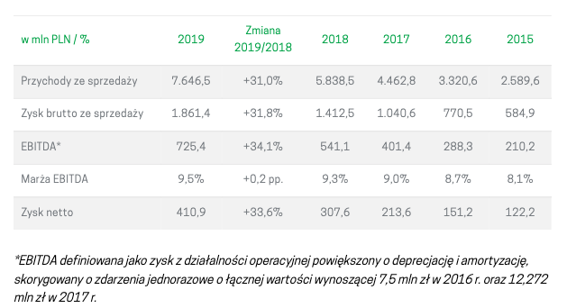
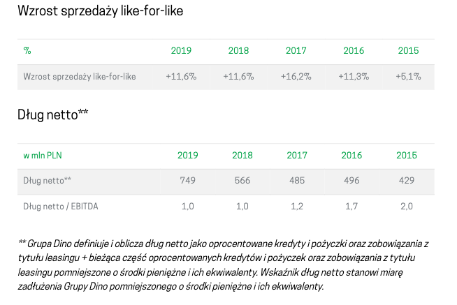

```{r global_options, include=FALSE}
library('tidyverse')
library('knitr')
library('kableExtra')
#source(file = 'bilans.R')
#source(file = 'rzis.R')
source(file = 'wskazniki.R')

#knitr::opts_chunk$set(fig.width=12, fig.height=8, fig.path='Figs/',
knitr::opts_chunk$set(echo=FALSE, warning=FALSE, message=FALSE, results='asis')
```

```{r setup, include=FALSE}
pagebreak <- function() {
  if(knitr::is_latex_output())
    return("\\newpage")
  else {
    return('<hr style="height:1px;border:none;color:#333;background-color:#333;" /> <div style="page-break-before: always;" />')
  }
}

select_rows <- function(tabl, pattern_r) {
    return(na.omit(tabl %>% 
                   select(1) %>% 
                   mutate_at(vars(1), ~ ifelse(str_detect(.x, pattern_r), row_number(), NA)) %>% 
                   unlist(., use.names=FALSE)))
}
```

`r pagebreak()`

## 1 Dane spółki, charakterystyka, notowania

Spółka [Dino](https://grupadino.pl) to Polska sieć handlu spożywczego założona w 1999 roku przez Tomasza Biernackiego. Jest to wiodący gracz w rosnącym segmencie średniej wielkości supermarketów w Polsce, zlokalizowanych głównie w mniejszych miejscowościach, małych i średnich
miastach oraz na peryferiach dużych miast. W latach 2010-2019 liczba sklepów wzrosła ze 111 na koniec 2010 do 1218 na koniec 2019 roku.

* **Zarząd Spółki**: Szymon Piduch – Prezes Zarządu, Michał Krauze – Członek Zarządu, Dyrektor Finansowy, Michał Muskała – Członek Zarządu, Dyrektor Inwestycji
* **Rada Nadzorcza**: Tomasz Biernacki - przewodniczący rady nadzorczej, Eryk Bajer - członek rady nadzorczej, Sławomir Jakszuk - niezależny członek rady nadzorczej, Piotr Nowjalis - niezależny członek rady nadzorczej, Maciej Polanowski - członek rady nadzorczej
* **Siedziba Spółki**: ul. Ostrowska 122, 63-700 Krotoszyn, Polska
* **Komitet audytu**: Piotr Nowjalis – przewodniczący komitetu audytu, Sławomir Jakszuk – członek komitetu audytu, Maciej Polanowski – członek komitetu audytu

### 1.1 Historia rozwoju

Grupa Dino jest jedną z najszybciej rozwijających się sieci supermarketów *proximity* w Polsce – zarówno pod względem liczby sklepów, jak i przychodów ze sprzedaży.

Poniżej przedstawiamy wydarzenia, które odegrały ważną rolę w jej historii.

- 1999 : Pierwsze sklep pod marką Dino
- 2002 : Pierwsze centrum dystrybucyjne
- 2003 : Dino zacieśnia relacje z zakadami mięsnymi Agro-Rydzyna
- 2004-2009 : Rozwój wokół centrum dystrybucyjnego
- 2010 : 100 Sklepów i okres dynamicznej ekspansji
- 2013 : 300 sklepów i drugie centrum Dystrybucyjne
- 2014 - 2015 : 500 sklepów 
- 2016 : 10,000 pracaowników i trzecie centrum Dystrybucyjne
- 2017 : Debiut na GPW
- 2018 : 202 otwarcia nowych marketów
- 2019 : 243 nowe markety


### 1.2 Akcjonariat

{ width=70% }

Każda akcja Dino Polska S.A. uprawnia do wykonywania jednego głosu na walnym zgromadzeniu.

Ponad 50% udziałow należy do założyciela spółki.

### 1.3 Wybrane dane finansowe

{ width=70% }

{ width=70% }


### 1.4 Notowania giełdowe spółki

Kurs odniesienia spółki Grupa Dino 8 maja wynosiła 169,90 zł. 

Od debiutu w GPW zauważalny jest widoczny trend wznoszący wskazujący apetyt inwestorów na spółki najszybciej rozwijające się.

{ width=70% }

        
#### 1.4.1 Cena akcji w porównaniu z WIG
<small>(na niebiesko: Dino, na żółto: WIG)</small>

{ width=70% }

Na wykresie widzimy wyraźny wzrost cen akcji Dino Polska w porównaniu z WIG.
Sytuacja związana z koronawirusem jedynie chwilowo wpłynęła na spadek
wartości akcji, po czym, znów nastąpił wzrost.

Supermarkety nie należą do rodzaju spółek cyklicznych, a wieć
koniunktura gospodarcza nie ma wiekszego wpływu na 
działalność.

### 1.5 Konkurencja
   
   stokrotka franczyza
   privatny
   
   polomarket privatny
   Sporządzony zgodnie z MSR:	Nie
   https://ekrs.ms.gov.pl/
   
Jerónimo Martins in Portugal
Jerónimo Martins in Poland
Jerónimo Martins in Colombia

Food Distribution
Food distribution is our core business and represents over 95% of our consolidated sales. In Portugal, we are leaders in the Supermarket segment through the Pingo Doce chain and in the Cash & Carry segment with Recheio. In Poland, Biedronka is the biggest Food Distribution chain in the country, over 3,000 stores. 

Our presence in Colombia is more recent, as we entered this market in 2013

Food Distribution
Specialised Retail
Agribusiness


```{r results='asis', warning=FALSE, echo=FALSE}
tribble(
  ~Sieć, ~`Liczba sklepów w Polsce`, ~Siedziba,
  "Biedronka", 3000, "Portugalia",
  "Dino",1218, "Polska",
  "Lidl", 700, "Niemcy",
  "Stokrotka", 577, "Polska",
  "Netto", 368, "Dania",
  "Polomarket", 280, "Polska",
  "Eurospar", 250, "Holandia",
  "Intermarché", 230, "Francja",
  "Mila",187, "Polska",
  "ChataPolska", 166, "Polska",
  "Aldi",132, "Niemcy",
  "PiotriPaweł", 70, "Polska",
  "Arhelan", 55, "Polska",
  "Frac", 21, "Polska",
  "Auchan", 33, "Francja",
) %>% kable(booktabs = T) 

```

<small>żródło: Wikipedia </small>


## 2 Wstępna analiza bilansu
### 2.1 Analiza pionowa bilansu

```{r}

aktywa_st %>% 
  select(!matches('15|16|_sk')) %>% 
  filter_at(vars(1), ~ str_detect(.x, '^[VIAB]')) %>% 
  mutate(`Wyszczegónienie` = 
           cell_spec(`Wyszczegónienie`, 
                     italic = ifelse(row_number() %in% c(2:6, 8:11), T, F))) %>%
  kable(escape = F,
        col.names = c("Aktywa", '2017', '2018', '2019', '2017', 
                                  '2018', '2019', '2017', '2018', '2019'),
        align=c("l",rep("r",9)),
        booktabs=TRUE) %>% 
  kable_styling(latex_options = c("striped", "scale_down"),
                bootstrap_options = c("striped", "hover", "condensed")) %>% 
  add_header_above(c(" " = 1, "Stan na koniec roku (w.tys.zł.)" = 3, 
                     "Struktura (w%)" = 3, "Str. wewn. (w%)" = 3)) %>% 
  row_spec(c(1, 7, 12), bold = T) %>% 
  column_spec(5:7, background = "#F0FBEF")

```


```{r}

pasywa_st %>% 
  select(!matches('15|16|_sk')) %>% 
  filter_at(vars(1), ~ str_detect(.x, '^[VIABP]')) %>% 
  mutate(`Wyszczegónienie` = 
           cell_spec(`Wyszczegónienie`, 
                     italic = ifelse(row_number() %in% c(2:9, 11:14), T, F))) %>%
  kable(escape = F, booktabs = T, align=c("l",rep("r",9)), 
    col.names = c("Pasywa", '2017', '2018', '2019', 
    '2017', '2018', '2019', '2017', '2018', '2019')) %>% 
  kable_styling(latex_options = c("striped", "scale_down"),
                bootstrap_options = c("striped", "hover", "condensed")) %>% 
  add_header_above(c(" " = 1, "na koniec roku (w. tys. zł.)" = 3, 
                     "Struktura (w%)" = 3, "Str. wewn. (w%)" = 3)) %>% 
  row_spec(c(1, 10, 15), bold = T) %>% 
  column_spec(5:7, background = "#F0FBEF")
```

### 2.2 Analiza pozioma bilansu

```{r}
col_names <- c("Aktywa", '2017', '2018', '2019', '2018', '2019',
               '2017/18', '2018/19', '2017/18', '2018/19')
aktywa %>% 
  select_at(vars(1, 4:6, 9:10, 13:14, 17:18)) %>%
  filter_at(vars(1), ~ str_detect(.x, '^[VIAB]')) %>% 
  mutate(`Wyszczegónienie` = 
           cell_spec(`Wyszczegónienie`, 
                     italic = ifelse(row_number() %in% c(2:6, 8:11), T, F))) %>%
  kable(escape = F, col.names = col_names, booktabs = T,
        align=c("l",rep("r",9))) %>% 
  kable_styling(latex_options = c("striped", "scale_down"),
                bootstrap_options = c("striped", "hover", "condensed")) %>% 
  add_header_above(c(" " = 1, "Ceny bieżące" = 3, "Ceny skorygowane" = 2, 
                     "W cenach bieżących" = 2, "W cenach skorygowanych" = 2)) %>% 
  add_header_above(c(" " = 1, "Stan na koniec roku (w. tys. zł.)" = 5, 
                     "Dynamika (w%)" = 4)) %>% 
  row_spec(c(1, 7, 12), bold = T) %>% 
  column_spec(5:6, background = "#F0FBEF") %>% 
  column_spec(9:10, background = "#F0FBEF")
```

```{r}
col_names <- c("Pasywa", '2017', '2018', '2019', '2018', '2019',
               '2017/18', '2018/19', '2017/18', '2018/19')
pasywa %>% 
  select_at(vars(1, 4:6, 9:10, 13:14, 17:18)) %>%
  filter_at(vars(1), ~ str_detect(.x, '^[VIABP]')) %>% 
  mutate(`Wyszczegónienie` = 
           cell_spec(`Wyszczegónienie`, 
                     italic = ifelse(row_number() %in% c(2:9, 11:14), T, F))) %>%
  kable(escape = F, col.names = col_names, booktabs = T,
        align=c("l",rep("r",9))) %>% 
  kable_styling(latex_options = c("striped", "scale_down"),
                bootstrap_options = c("striped", "hover", "condensed")) %>% 
  add_header_above(c(" " = 1, "Ceny bieżące" = 3, "Ceny skorygowane" = 2, 
                     "W cenach bieżących" = 2, "W cenach skorygowanych" = 2)) %>% 
  add_header_above(c(" " = 1, "Stan na koniec roku (w. tys. zł.)" = 5, 
                     "Dynamika (w%)" = 4)) %>% 
  row_spec(c(1, 10, 15), bold = T) %>% 
  column_spec(5:6, background = "#F0FBEF") %>% 
  column_spec(9:10, background = "#F0FBEF")

```

### 2.2 Kapitał obrotowy netto

```{r}
kon <- tribble(
  ~" ", ~"2018", ~"2019", ~"2018_s", ~"2019_s",
  'Kapitał stały', '', '', '', '',
  '1. Kapitał własny', '', '', '', '', 
  '2. Rezerwy długoterminowe', '', '', '', '', 
  '3. Zobowiązania długoterminowe ', '', '', '', '', 
  'Kapitał stały ogółem', '', '', '', '', 
  'Aktywa stałe', '', '', '', '',
  'Aktywa stałe ogółem', '', '', '', '',
  'Aktywa bieżące', '', '', '', '',
  'Aktywa bieżące ogółem', '', '', '', '',
  'Zobowiązania bieżące', '', '', '', '',
  'Rezerwy na zobowiązania krótkoterminowe', '', '', '', '',
  'Rozliczenia międzyokresowe krótkoterminow', '', '', '', '',
  'Zobowiązania bieżące ogółem', '', '', '', '',
  'Kapitał stały', '', '', '', '',
  'Aktywa stałe', '', '', '', '',
  'Kapitał obrotowy netto', '', '', '', '',
)

g <- function(tabl, rw, yr) {
  n <- (tabl %>% slice(rw) %>% select(yr))[[1]]
  return(if_else(is.na(as.numeric(n)), 0, as.numeric(n)))  
}

kap_ob_n <- function(kon, col_n, yr) {
  
  kon <- kon %>% 
    mutate_at(vars(col_n), ~ ifelse(row_number() == 2, g(pasywa, 1, yr), as.character(.x))) %>% 
    mutate_at(vars(col_n), ~ ifelse(row_number() == 3, g(pasywa, 12, yr), as.character(.x))) %>% 
    mutate_at(vars(col_n), ~ ifelse(row_number() == 4, g(pasywa, 16, yr), as.character(.x))) %>% 
    mutate_at(vars(col_n), ~ ifelse(row_number() == 5, 
                                g(pasywa, 1, yr) +
                                  g(pasywa, 12, yr) +
                                  g(pasywa, 16, yr), as.character(.x))) %>% 
    mutate_at(vars(col_n), ~ ifelse(row_number() == 6, g(aktywa, 1, yr), as.character(.x))) %>% 
    mutate_at(vars(col_n), ~ ifelse(row_number() == 7, g(aktywa, 1, yr), as.character(.x))) %>% 
    mutate_at(vars(col_n), ~ ifelse(row_number() == 8, g(aktywa, 21, yr), as.character(.x))) %>% 
    mutate_at(vars(col_n), ~ ifelse(row_number() == 9, g(aktywa, 21, yr), as.character(.x))) %>% 
    mutate_at(vars(col_n), ~ ifelse(row_number() == 10, g(pasywa, 23, yr), as.character(.x))) %>% 
    mutate_at(vars(col_n), ~ ifelse(row_number() == 11, '0', as.character(.x))) %>% 
    mutate_at(vars(col_n), ~ ifelse(row_number() == 12, g(pasywa, 44, yr), as.character(.x))) %>% 
    mutate_at(vars(col_n), ~ ifelse(row_number() == 13, 
                                g(pasywa, 23, yr) + 
                                  g(pasywa, 44, yr), as.character(.x))) 
  
  kon <- kon %>% 
    mutate_at(vars(col_n), ~ ifelse(row_number() == 14, g(kon, 5, yr), as.character(.x))) %>%
    mutate_at(vars(col_n), ~ ifelse(row_number() == 15, g(kon, 7, yr), as.character(.x))) %>% 
    mutate_at(vars(col_n), ~ ifelse(row_number() == 16, g(kon, 5, yr) - 
                                  g(kon, 7, yr), as.character(.x)))
  
  return(kon)
}
 
kon <- kap_ob_n(kon, 2, '2018')
kon <- kap_ob_n(kon, 3, '2019')

kon <- kon %>% 
  mutate_at(vars(4), ~ ifelse(row_number() %in% c(2:5), 
                                    round(g(kon, row_number(), '2018') / 
                                            g(kon, 5, '2018') * 100, 
                                          digits=1), as.character(.x))) %>% 
  mutate_at(vars(5), ~ ifelse(row_number() %in% c(2:5), 
                                    round(g(kon, row_number(), '2019') / 
                                            g(kon, 5, '2019') * 100, 
                                          digits=1), as.character(.x)))

```

```{r}
col_names <- c("", '2018', '2019', '2018', '2019')

kon %>% 
  kable(escape = F, col.names = col_names, booktabs = T,
        align=c("l",rep("r",4))) %>% 
  kable_styling(latex_options = c("striped", "scale_down"),
                bootstrap_options = c("striped", "hover", "condensed"),
                full_width = F) %>% 
  add_header_above(c("Wyszczególnienie" = 1, "Wartość(w tys.zł.)" = 2, 
                     "Struktura kapitałów stałych (w %)" = 2)) %>%
  row_spec(c(5, 7, 9, 13, 16), bold = T)

```

`r pagebreak()`

### 2.3 Analiza wskażnikowa

```{r}
wskaźniki <- wskaźniki_bilans()
```

#### 2.2.1 Wskaźnik pokrycia aktywów trwałych kapitałem własnym
     
$$\small \frac{Kapitał\ własny}{Aktywa\ trwałe} * 100$$


```{r}
wskaźniki %>% 
  slice(1) %>% 
  select(-1) %>% 
  kable(escape = F, booktabs = T) %>%
  kable_styling(c("striped", "condensed"), full_width = F) %>% 
  row_spec(c(1), color = "#8B0000") 

```

#### 2.2.2 Wskaźnik pokrycia aktywów trwałych kapitałem stałym
     
$$\small \frac{Kapitał\ stały}{Aktywa\ trwałe} * 100$$


```{r}
wskaźniki %>% 
  slice(2) %>% 
  select(-1) %>% 
  kable(escape = F, booktabs = T) %>%
  kable_styling(c("striped", "condensed"), full_width = F) %>% 
  row_spec(c(1), color = "#8B0000") 

```

#### 2.2.3 Wskaźnik pokrycia aktywów obrotowych zobowiązianimi trótkoterminowymi
     
$$\small \frac{Zobowiązania\ krótkoterminowe}{Aktywa\ obrotowe} * 100$$


```{r}
wskaźniki %>% 
  slice(3) %>% 
  select(-1) %>% 
  kable(escape = F, booktabs = T) %>%
  kable_styling(c("striped", "condensed"), full_width = F) %>% 
  row_spec(c(1), color = "#8B0000") 

```

#### 2.2.4 Udział kapitału obrotowego netto w finansowaniu aktywów ogółem
     
$$\small \frac{Kapitał\ obrotowy\ netto}{Aktywa\ ogółem} * 100$$


```{r}
wskaźniki %>% 
  slice(4) %>% 
  select(-1) %>% 
  kable(escape = F, booktabs = T) %>%
  kable_styling(c("striped", "condensed"), full_width = F) %>% 
  row_spec(c(1), color = "#8B0000") 

```

#### 2.2.5 Udział kapitału obrotowego netto w finansowaniu aktywów obrotowych przedsiębiorstwa
     
$$\small \frac{Kapitał\ obrotowy\ netto}{Aktywa\ obrotowe} * 100$$


```{r}
wskaźniki %>% 
  slice(5) %>% 
  select(-1) %>% 
  kable(escape = F, booktabs = T) %>%
  kable_styling(c("striped", "condensed"), full_width = F) %>% 
  row_spec(c(1), color = "#8B0000") 

```

`r pagebreak()`

## 3 Wstępna analiza rachunku zysków i strat

### 3.1 Analiza pionowa rachunku zysków i strat


```{r}

mrzis %>% 
  select_at(vars(1:4, 7:9)) %>% 
  kable(escape = F,
        col.names = c("Elementy rachunku zysków i strat", 
                      '2017', '2018', '2019', 
                      '2017', '2018', '2019'),
        align=c("l",rep("r",6)),
        booktabs=TRUE) %>% 
  kable_styling(latex_options = c("striped", "scale_down"),
                bootstrap_options = c("striped", "hover", "condensed")) %>% 
  add_header_above(c(" " = 1, "Wyniki finansowe (w.tys.zł.)" = 3, 
                     "Struktura (w%)" = 3)) %>% 
  column_spec(5:7, background = "#F0FBEF")

```

### 3.2 Analiza pozioma rachunku zysków i strat

```{r}
col_names <- c("Elementy rachunku zysków i strat", 
               '2017', '2018', '2019', '2018', '2019',
               '2017/18', '2018/19', '2017/18', '2018/19')
mrzis %>% 
  select_at(vars(1:6, 10:13)) %>% 
  kable(escape = F, col.names = col_names, booktabs = T,
        align=c("l",rep("r",9))) %>% 
  kable_styling(latex_options = c("striped", "scale_down"),
                bootstrap_options = c("striped", "hover", "condensed")) %>% 
  add_header_above(c(" " = 1, "Ceny bieżące" = 3, "Ceny skorygowane" = 2, 
                     "W cenach bieżących" = 2, "W cenach skorygowanych" = 2)) %>% 
  add_header_above(c(" " = 1, "Wyniki finansowe (w.tys.zł.)" = 5, 
                     "Dynamika (w%)" = 4)) %>% 
  row_spec(c(1, 7, 12), bold = T) %>% 
  column_spec(5:6, background = "#F0FBEF") %>% 
  column_spec(9:10, background = "#F0FBEF")
```


`r pagebreak()`

### 3.3 Analiza wskażnikowa

```{r}
wskaźniki <- wskaźniki_rzis()
```
     
$$\small \frac{Zysk\ z\ działalności\ operacyjnej}{Zysk\ ze\ sprzedaży} * 100$$


```{r}
wskaźniki %>% 
  select(c(1, 2)) %>% 
  pivot_wider(names_from = rok, values_from = `1`) %>% 
  kable(escape = F, booktabs = T) %>%
  kable_styling(c("striped", "condensed"), full_width = F) %>% 
  row_spec(c(1), color = "#8B0000") 
```

$$\small \frac{Zysk\ brutto}{Zysk\ z\ działalności\ operacyjnej} * 100$$


```{r}
wskaźniki %>% 
  select(c(1, 3)) %>% 
  pivot_wider(names_from = rok, values_from = `2`) %>% 
  kable(escape = F, booktabs = T) %>%
  kable_styling(c("striped", "condensed"), full_width = F) %>% 
  row_spec(c(1), color = "#8B0000") 
```

$$\small \frac{Zysk\ brutto}{Zysk\ ze\ sprzedaży} * 100$$


```{r}
wskaźniki %>% 
  select(c(1, 4)) %>% 
  pivot_wider(names_from = rok, values_from = `3`) %>% 
  kable(escape = F, booktabs = T) %>%
  kable_styling(c("striped", "condensed"), full_width = F) %>% 
  row_spec(c(1), color = "#8B0000") 
```

$$\small \frac{Zysk\ netto}{Zysk\ ze\ sprzedaży} * 100$$


```{r}
wskaźniki %>% 
  select(c(1, 5)) %>% 
  pivot_wider(names_from = rok, values_from = `4`) %>% 
  kable(escape = F, booktabs = T) %>%
  kable_styling(c("striped", "condensed"), full_width = F) %>% 
  row_spec(c(1), color = "#8B0000") 
```

$$\small \frac{Podatek\ dochodowy}{Zysk\ brutto} * 100$$


```{r}
wskaźniki %>% 
  select(c(1, 6)) %>% 
  pivot_wider(names_from = rok, values_from = `5`) %>% 
  kable(escape = F, booktabs = T) %>%
  kable_styling(c("striped", "condensed"), full_width = F) %>% 
  row_spec(c(1), color = "#8B0000") 
```

## 4 Analiza rachunku przepływów pieniężnych

### 4.1 Syntetyczna analiza sald

```{r}
rpp %>% 
  select(!contains('/')) %>% 
  filter_at(vars(1), ~ str_starts(.x, '[IA-Z]')) %>% 
  kable(booktabs = T, escape = F,
        align=c("l",rep("r",5))) %>%
  kable_styling(latex_options = c("striped"),
                full_width = F,
                bootstrap_options = c("striped", "hover", "condensed")) %>%
  row_spec(c(4, 8, 12, 16), color = "#8B0000") %>% 
  row_spec(c(1, 5, 9, 13:16), bold = T) %>% 
  add_header_above(c(" " = 1, "w tys. zl." = 5))
```

### 4.2 Analiza pionowa rachunku przepływów pieniężnych

```{r}
rpp_str %>% 
  kable(booktabs = T, escape = F, col.names = gsub("_st", "", names(rpp_str)),
        align=c("l",rep("r",5))) %>%
  kable_styling(latex_options = c("striped"),
                full_width = F,
                bootstrap_options = c("striped", "hover", "condensed")) %>%
  column_spec(5:7, background = "#F0FBEF") %>% 
  add_header_above(c(" " = 1, "Wartość (w tys. zł.)" = 3, "Struktura (w %)" = 3))

```

### 4.3 Analiza pozioma rachunku przepływów pieniężnych

```{r}
rpp %>% 
  #slice(1:14) %>% 
  filter_at(vars(1), ~ !str_starts(.x, '[-abc]')) %>%
  mutate_all(~ str_remove(.x, '^-$')) %>% 
  mutate_at(vars(1), ~ str_trunc(.x, 74, "right")) %>% 
  kable(booktabs = T, escape = F,
        align=c("l",rep("r",9))) %>%
  kable_styling(latex_options = c("striped", "scale_down"),
                full_width = F,
                bootstrap_options = c("striped", "hover", "condensed")) %>%
  row_spec(c(1:3, 14:15, 20, 24:26, 31, 41:45), bold = T) %>% 
  row_spec(c(1, 25, 15, 45), color = "#8B0000") %>% 
  column_spec(7:10, background = "#F0FBEF") %>% 
  add_header_above(c(" " = 1, "Wartość (w tys. zl.)" = 5, "Dynamika (w %)" = 4))

```


### 4.4 Analiza wskażnikowa


```{r}
wskaźniki <- wskaźniki_rpp()
```
#### 4.3.1 Wskaźniki struktury przepływów pieniężnych

$$\small \frac{Zysk\ netto}{Przepływy\ pieniężne\ netto\ z\ działalności\ operacyjnej} * 100$$
   
```{r }

wskaźniki %>% 
  select(1:2) %>% 
  pivot_wider(names_from = rok, values_from = `1.1`) %>% 
  kable(escape = F, booktabs = T) %>%
  kable_styling(c("striped", "condensed"), full_width = F) %>% 
  row_spec(c(1), color = "#8B0000") 
```
    
       
$$\small \frac{Amortyzacja}{Przepływy\ pieniężne\ netto\ z\ działalności\ operacyjnej} * 100$$
      
```{r }
wskaźniki %>% 
  select(c(1, 3)) %>% 
  pivot_wider(names_from = rok, values_from = `1.2`) %>% 
  kable(escape = F, booktabs = T) %>%
  kable_styling(c("striped", "condensed"), full_width = F) %>% 
  row_spec(c(1), color = "#8B0000") 

```

#### 4.3.2 Wskaźniki wystarczalności środków pieniężnych

##### 4.3.2.1 Wskaźnik ogólnej wystarczalności środków pieniężnych
       
$$\small \frac{Przepływy\ pieniężne\ netto\ z\ działalności\ operacyjnej}{Wydatki\ ogółem} * 100$$
   
    
```{r }
wskaźniki %>% 
  select(c(1, 4)) %>% 
  pivot_wider(names_from = rok, values_from = `2.1`) %>% 
  kable(escape = F, booktabs = T) %>%
  kable_styling(c("striped", "condensed"), full_width = F) %>% 
  row_spec(c(1), color = "#8B0000") 

```
  
##### 4.3.2.2 Wskaźnik pokrycia zadłużenia
    
$$\small \frac{Przepływy\ pieniężne\ netto\ z\ działalności\ operacyjnej}{Spłata\ zadłużenia} * 100$$
     
```{r }
wskaźniki %>% 
  select(c(1, 5)) %>% 
  pivot_wider(names_from = rok, values_from = `2.2`) %>% 
  kable(escape = F, booktabs = T) %>%
  kable_styling(c("striped", "condensed"), full_width = F) %>% 
  row_spec(c(1), color = "#8B0000") 

```

##### 4.3.2.3 Wskaźnik pokrycia wydatków inwestycyjnych
    
$$\small \frac{Przepływy\ pieniężne\ netto\ z\ działalności\ operacyjnej}{Wydatki\ inwestycyjne} * 100$$
       
```{r}
wskaźniki %>% 
  select(c(1, 6)) %>% 
  pivot_wider(names_from = rok, values_from = `2.3`) %>% 
  kable(escape = F, booktabs = T) %>%
  kable_styling(c("striped", "condensed"), full_width = F) %>% 
  row_spec(c(1), color = "#8B0000") 

```
      
      ##### 4.3.2.4 Wskaźnik pokrycia wypłaty dywidend
       
$$\small \frac{Przepływy\ pieniężne\ netto\ z\ działalności\ operacyjnej}{Wypłaty\ dywidend} * 100$$

        
```{r}
wskaźniki %>% 
  select(c(1, 7)) %>% 
  pivot_wider(names_from = rok, values_from = `2.4`) %>% 
  #mutate_all(~ str_replace(.x, '-', '&#8208;')) %>% 
  kable(escape = F, booktabs = T) %>%
  kable_styling(c("striped", "condensed"), full_width = F) %>% 
  row_spec(c(1), color = "#8B0000") 

```

       
##### 4.3.2.5 Wskaźnik pieniężnej płynności finansowej
      
$$\small \frac{Przepływy\ pieniężne\ netto\ z\ działalności\ operacyjnej}{Zobowiązania\ krótkoterminowe} * 100$$
    
```{r}
wskaźniki %>% 
  select(c(1, 8)) %>% 
  pivot_wider(names_from = rok, values_from = `2.5`) %>% 
  kable(escape = F, booktabs = T) %>%
  kable_styling(c("striped", "condensed"), full_width = F) %>% 
  row_spec(c(1), color = "#8B0000") 

```


#### 4.3.3 Wskaźniki wydajności pieniężnej
    
##### 4.3.3.1 Wskaźnik pieniężnej wydajności sprzedaży
    
$$\small \frac{Przepływy\ pieniężne\ netto\ z\ działalności\ operacyjnej}{Przychody\ ze\ sprzedaży} * 100$$

        
```{r}
wskaźniki %>% 
  select(c(1, 9)) %>% 
  pivot_wider(names_from = rok, values_from = `3.1`) %>% 
  kable(escape = F, booktabs = T) %>%
  kable_styling(c("striped", "condensed"), full_width = F) %>% 
  row_spec(c(1), color = "#8B0000") 

```
 
##### 4.3.3.2 Wskaźnik pieniężnej płynności finansowej
      
$$\small \frac{Przepływy\ pieniężne\ netto\ z\ działalności\ operacyjnej}{Zysk\ ze\ sprzedaży} * 100$$
    
```{r}
wskaźniki %>% 
  select(c(1, 10)) %>% 
  pivot_wider(names_from = rok, values_from = `3.2`) %>% 
  kable(escape = F, booktabs = T) %>%
  kable_styling(c("striped", "condensed"), full_width = F) %>% 
  row_spec(c(1), color = "#8B0000") 

```

        
##### 4.3.3.3 Wskaźnik pieniężnej wydajności aktywów
    
$$\small \frac{Przepływy\ pieniężne\ netto\ z\ działalności\ operacyjnej}{Aktywa\ ogółem} * 100$$
        
```{r}
wskaźniki %>% 
  select(c(1, 11)) %>% 
  pivot_wider(names_from = rok, values_from = `3.3`) %>% 
  kable(escape = F, booktabs = T) %>%
  kable_styling(c("striped", "condensed"), full_width = F) %>% 
  row_spec(c(1), color = "#8B0000") 

```
    
##### 4.3.3.4 Wskaźnik pieniężnej wydajności kapitału własnego
    
$$\small \frac{Przepływy\ pieniężne\ netto\ z\ działalności\ operacyjnej}{Kapitał\ własny} * 100$$

        
```{r}
wskaźniki %>% 
  select(c(1, 12)) %>% 
  pivot_wider(names_from = rok, values_from = `3.4`) %>% 
  kable(escape = F, booktabs = T) %>%
  kable_styling(c("striped", "condensed"), full_width = F) %>% 
  row_spec(c(1), color = "#8B0000") 

```


`r pagebreak()`

## 5 Analiza wskaźnikowa

```{r}

wsk2 %>% 
  kable(booktabs = T, 
        col.names = c('Wyszczególnienie', '2015', '2016',
                      '2017', '2018', '2019', '2018', '2019')) %>% 
        #align=c("l",rep("r",7))) %>%
  kable_styling(latex_options = c("striped"),
                 full_width = F,
                 bootstrap_options = c("striped", "hover", "condensed")) %>%
  column_spec(7:8, background = "#F0FBEF") %>% 
  add_header_above(c(" " = 1, "Grupa Dino" = 5, "Jeronimo Martins" = 2))

```

### 5.1 Wskaźniki płynności


### 5.2 Wskaźniki zadłużenia

### 5.3 Wskaźniki operacyjności


### 5.4 Wskaźniki rentowności

### 5.5 Wskaźniki rynkowe

 Wskaźnikcena-zysk(P/E)
cena rynkowa 1 akcji 
Zysk netto na 1 akcję

Wskaźnik cena do wartości księgowej (P/BV):
cena 1 akcji
wartość księgowa na 1 akcję 

wskaźnik stopy dywidendy (DPS) =
dywidenda
cena rynkowa 1 akcji

### 5.6 Model DuPonta dla spółki Dino

```{r}
dp2 %>% 
  slice(1:5) %>% 
  kable(booktabs = T, escape = F,
        align=c("l",rep("r",5))) %>%
  kable_styling(latex_options = c("striped"),
                full_width = F,
                bootstrap_options = c("striped", "condensed"))
dp2 %>% 
  slice(6:10) %>% 
  #mutate_at(vars(2:6), ~ ifelse(row_number() %in% c(1, 3, 5), 
  #                              str_c(.x, " %"), as.character(.x))) %>% 
  kable(booktabs = T, 
        col.names = c("         ", names(dp2)[-1]),
        align=c("l",rep("r",5))) %>%
  kable_styling(latex_options = c("striped"),
                full_width = F,
                bootstrap_options = c("striped", "condensed"))
  
```

`r pagebreak()`

## 6 Podsumowanie Analizy spółki Grupa Dino

`r pagebreak()`

## Załącznik

### 1 Bilans

```{r}
bold_r <- function(tabl) {
  return(select_rows(tabl, '^[ABP]'))
}

italic_r <- function(tabl) {
  return(select_rows(tabl, '^[VI]'))
}

indent_r <- function(tabl) {
  return(setdiff(1:count(tabl)[[1]], c(bold_r(tabl), italic_r(tabl))))
}

```
#### 1.1 Aktywa

```{r}
aktywa %>%
  select_at(vars(1:6)) %>%
  mutate_at(vars(1:6), ~ifelse(.x == '-', '', as.character(.x))) %>%
  mutate_at(vars(1), ~ str_trunc(.x, 74, "right")) %>% 
  kable(booktabs = T, escape = F, longtable = T,
        align=c("l",rep("r",5))) %>%
  kable_styling(latex_options = c("striped"),
                bootstrap_options = c("striped", "condensed")) %>%
  #column_spec(1, width = "5in") %>%
  row_spec(bold_r(aktywa), bold = T) %>%
  row_spec(italic_r(aktywa), italic = T) %>%
  add_indent(indent_r(aktywa))
```
`r pagebreak()`

#### 1.2 Pasywa

```{r}
pasywa %>%
  select_at(vars(1:6)) %>%
  mutate_at(vars(1:6), ~ifelse(.x == '-', '', as.character(.x))) %>%
  mutate_at(vars(1), ~ str_trunc(.x, 74, "right")) %>% 
  kable(booktabs = T, escape = F, longtable = T,
        align=c("l",rep("r",5))) %>%
  #column_spec(1, width = "5in") %>%
  kable_styling(latex_options = c("striped"),
                bootstrap_options = c("striped", "hover", "condensed")) %>%
  row_spec(bold_r(pasywa), bold = T) %>%
  row_spec(italic_r(pasywa), italic = T) %>%
  add_indent(indent_r(pasywa))
  
```

`r pagebreak()`
### 2 Rachunek zysków is strat

```{r}
rzis %>%
  select_at(vars(1:6)) %>%
  mutate_at(vars(1:6), ~ifelse(.x == '-', '', as.character(.x))) %>%
  kable(booktabs = T, escape = F, longtable = T,
        align=c("l",rep("r",5))) %>%
  kable_styling(bootstrap_options = c("striped", "hover", "condensed")) %>%
  row_spec(select_rows(rzis, '^[ABCDEFGHJKLM]'), bold = T) %>%
  #row_spec(select_rows(rzis, '^[IV]'), italic = T)
  add_indent(select_rows(rzis, '^[-]'))
```

`r pagebreak()`

### 3 Rachunek przepływów pieniężnych

```{r}
rpp %>%
  select_at(vars(1:6)) %>%
  mutate_at(vars(1:6), ~ifelse(.x == '-', '', as.character(.x))) %>%
  mutate_at(vars(1), ~ str_trunc(.x, 74, "right")) %>% 
  kable(booktabs = T, escape = F, longtable = T,
        align=c("l",rep("r",5))) %>%
  #column_spec(1, width = "5in") %>%
  kable_styling(latex_options = c("striped"),
                bootstrap_options = c("striped", "hover", "condensed")) %>%
  row_spec(select_rows(rpp, '^[ABCDEFG]'), bold = T) %>%
  row_spec(select_rows(rpp, '^[IV]'), italic = T) %>%
  add_indent(setdiff(1:count(rpp)[[1]],
                     c(select_rows(rpp, '^[ABCDEFG]'),
                       select_rows(rpp, '^[IV]'))))
 
```